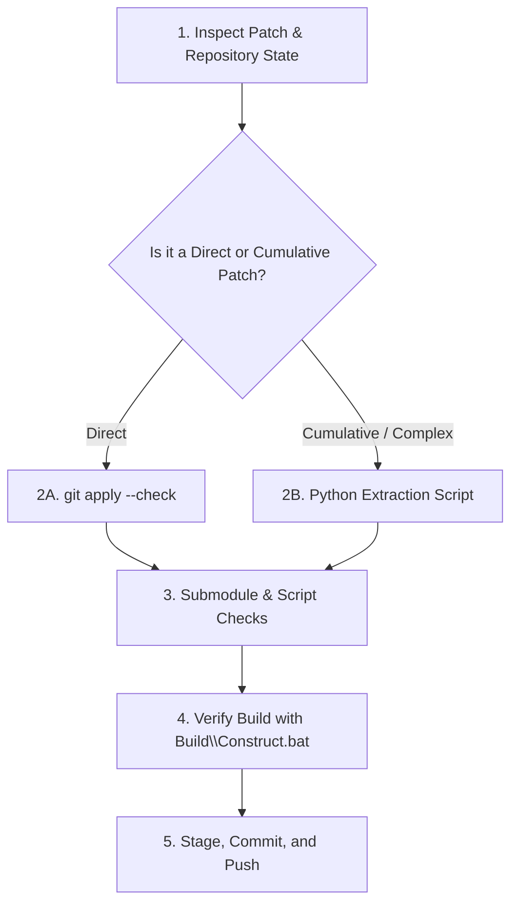

# Patch Application Instructions for AI Agents & Models

This document is an operational guide for agentic models of any size (including lighter/smaller models) on how to reliably inspect, extract, apply, verify, and commit patches in the Slate repository.

---

## 1. Types of Patches You Will Encounter

### Type A: Clean Incremental Patches (Single-Commit / Unified Diff)
- Example: `Phase24.patch`, `ControlPanelInteractions.patch`
- Structure: Standard `diff --git a/... b/...` modifying only the targeted files against a specific base commit.
- **Application Method**: Direct `git apply`.

### Type B: Cumulative IDE / Workspace Export Patches
- Example: `Patch/01a01101-8fd7-719f-b847-e83f07cfc5ce (3).patch`, `01a00b23-... (31).patch`
- Structure: An export of all workspace files where each file may be marked `new file mode 100644`, or containing nested `PhaseXX.patch` files, binary images (`.png`), and submodule references.
- **Common Failure**: Running `git apply` directly will fail with `already exists in working directory` or `cannot apply binary patch`.
- **Application Method**: Automated Python chunk extraction & file-level diffing (Section 3).

---

## 2. Standard Workflow Checklist

Follow these 5 steps in order:



---

## 3. Step-by-Step Instructions

### Step 1: Check Current Git State
Always inspect the current repository commit, branch, and working tree before touching files:
```powershell
git status
git log -n 5 --oneline
```

---

### Step 2: Applying the Patch

#### Method 2A: If applying a Direct / Standalone Patch (`PhaseXX.patch`)
1. Test if the patch applies cleanly:
   ```powershell
   git apply --check "path\to\patch.patch"
   ```
2. If it succeeds, apply:
   ```powershell
   git apply "path\to\patch.patch"
   ```
3. If it fails due to base commit mismatch (e.g. `patch failed: ...`), inspect `git log` to find the matching base commit and reset if explicitly instructed by the user:
   ```powershell
   git reset --hard <target_base_commit>
   git apply "path\to\patch.patch"
   ```

---

#### Method 2B: If applying a Cumulative / Full Workspace Patch (`01a0...patch`)
Because cumulative patches contain hundreds of unmodified files marked as new, use this reliable Python script to extract **only the truly new or modified files**:

```python
import re, os, codecs

patch_path = r"Patch\01a01101-8fd7-719f-b847-e83f07cfc5ce (3).patch"

with open(patch_path, "rb") as f:
    text = f.read().decode("utf-8", "ignore")

lines = text.splitlines(keepends=True)
chunks = {}
current_file = None
current_lines = []

for line in lines:
    if line.startswith("diff --git "):
        if current_file:
            chunks[current_file] = current_lines
        # Handle both quoted and unquoted paths: diff --git "a/..." "b/..."
        m = re.match(r'^diff --git (?:"a/(.+?)"|a/(\S+)) (?:"b/(.+?)"|b/(\S+))', line)
        if m:
            raw_fn = m.group(1) or m.group(2)
            if "\\" in raw_fn:
                try:
                    raw_fn = codecs.escape_decode(raw_fn.encode("latin1"))[0].decode("utf-8")
                except Exception:
                    pass
            current_file = raw_fn
        else:
            current_file = "unknown"
        current_lines = [line]
    else:
        if current_file:
            current_lines.append(line)

if current_file:
    chunks[current_file] = current_lines

def extract_content(flines):
    content_lines = []
    in_content = False
    for l in flines:
        if not in_content:
            if l.startswith("@@"): in_content = True
            continue
        if l.startswith("+"): content_lines.append(l[1:])
        elif l.startswith(" "): content_lines.append(l[1:])
        elif l == "\n" or l == "\r\n": content_lines.append(l)
    return "".join(content_lines)

applied = []
for fn, fl in chunks.items():
    # Skip submodules, binary files, root README, or redundant patch files
    if fn.startswith("ExternalPackages/") or fn.endswith(".png") or fn.endswith(".zip") or fn == "README.md" or fn.startswith("Patches/"):
        continue
    content = extract_content(fl)
    
    if not os.path.exists(fn):
        os.makedirs(os.path.dirname(fn), exist_ok=True)
        with open(fn, "w", encoding="utf-8", newline="\n") as out:
            out.write(content)
        applied.append((fn, "NEW"))
    else:
        with open(fn, "r", encoding="utf-8", errors="ignore") as f_exist:
            exist_content = f_exist.read()
        if content.replace("\r\n", "\n").strip() != exist_content.replace("\r\n", "\n").strip():
            with open(fn, "w", encoding="utf-8", newline="\n") as out:
                out.write(content)
            applied.append((fn, "MODIFIED"))

print(f"Applied {len(applied)} files:")
for path, status in applied:
    print(f" [{status}] {path}")
```

---

### Step 3: Handle Submodules and ImGui Patches

1. **Never edit `ExternalPackages/` by hand**. All deviations from vendored packages live in `Patches/`.
2. If `Patches/Patch*.patch` was updated:
   - Reset the ImGui submodule to its expected baseline:
     ```powershell
     cd ExternalPackages\imgui
     git reset --hard 83f668625ad45364de71d385aeb6a5dd04bee02e
     cd ..\..
     ```
   - Revert and re-apply patches via the repository script:
     ```powershell
     powershell -File Scripts\ApplyImGuiPatches.ps1 -Revert
     powershell -File Scripts\ApplyImGuiPatches.ps1
     ```

---

### Step 4: Verify the Build
Always run the full construction script to compile all units, link binaries, and update symbol indices:
```powershell
Build\Construct.bat
```

Ensure the following output is achieved:
- Exit code: `0`
- All translation units compiled (e.g. `SlateMath.lib`, `SlateDocument.lib`, `SlateVulkan.lib`, `SlateCompute.lib`, `SlateUI.lib`)
- Applications linked (`ConsoleHost.exe`, `PaintHost.exe`, `EditorHost.exe`, `InterfaceValidationHost.exe`)
- Symbol index and upload completed.

---

### Step 5: Stage, Commit, and Push

1. Check exact diffs:
   ```powershell
   git status
   git diff --stat Engine/
   ```
2. Clean up any temporary python scripts or extracted files:
   ```powershell
   Remove-Item -Force scratch_*.py, Phase*.patch -ErrorAction SilentlyContinue
   ```
3. Stage modified and new source files (avoid staging build artifacts or dirty submodule commits):
   ```powershell
   git add Engine/ Patches/ AgenticInstuctions/ References/
   ```
4. Commit with a concise descriptive message:
   ```powershell
   git commit -m "Implement <FeatureName>: <summary of components updated>"
   ```
5. Push to the remote repository:
   ```powershell
   git push origin master
   ```
   *(Use `git push --force-with-lease origin master` only if you performed an intentional hard reset requested by the user).*

---

## 4. Key Rules to Avoid Errors

1. **Avoid Console Encoding Crashes**:
   - In Python scripts, avoid raw printing of special Unicode characters (e.g. `🔴`, `📝`, `🧩`) directly to Windows `cp1252` console stdout. Use `repr()` or `ascii()` when logging strings in scripts.
2. **Never Stage Temporary Files**:
   - Always delete helper `.py` files and extracted scratch files before running `git add`.
3. **Preserve Line Endings**:
   - Always write C++ source and header files using UTF-8 encoding with newline `\n`.
