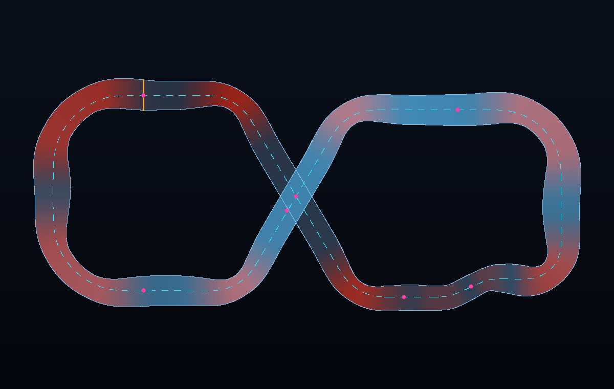

# MOTORBALL → IRON CITY GRAND PRIX

**Redesigning the Motorball track from _Alita: Battle Angel_ as a race-car circuit.**

_(`docs/track-map.png` and `docs/track-map.svg` are generated straight from the game's
spline by `node tools/trackpng.mjs` / `node tools/trackmap.mjs`, so the plan can never
drift from what you actually drive.)_

---

## 1. What the original actually looks like

Research notes gathered before drawing anything:

| Source | What it told us |
| --- | --- |
| Framestore VFX breakdown of the film | The Motorball stadium was built from **321 separate assets** around a crowd of **100,000**; the track itself is a distinct structure dropped into the bowl, not painted on the floor ([framestore.com](https://www.framestore.com/work/alita-battle-angel)) |
| First-look report from NYCC | "An overhead of a **huge stadium with a winding track**, not dissimilar to _Speed Racer_… part **Rollerball**, part **NASCAR**, all anime" ([superherohype.com](https://www.superherohype.com/news/423015-motorball-footage-from-alita-battle-angel-revealed-at-nycc)) |
| Barry Keenan's ArtStation shot list for the film | The areas that got up-rezzed were the **starting light**, the **motorball trap**, and the **curved track sections** — i.e. the three signature set-pieces ([artstation.com](https://www.artstation.com/artwork/4XKYl1)) |
| Framestore stills | A **bridge that splits open** mid-race — the track crosses over itself |
| _Gunnm_ / Battle Angel Alita wiki | Motorball courses are "big structures formed by **multiple labyrinths with complex and dangerous layout**", a mix of baseball and **Formula 1**-style racing, run on **10 huge circuits** across the Scrapyard ([battleangel.fandom.com](https://battleangel.fandom.com/wiki/Motorball)) |

Distilled visual grammar of the film track:

1. **A trough, not a road.** The roadway is U-shaped — flat in the middle, curving up into
   half-pipe walls so skaters can run the wall through a corner.
2. **Extreme banking** in the big curves, enough to be near-vertical at the rim.
3. **Elevated steel.** The whole circuit sits on rusted scrap-steel lattice pylons above
   the crowd floor, with a solid deck underside.
4. **Tunnels / covered sections** with ribbed arches and light strips.
5. **A crossover bridge** over another part of the track.
6. **A start gantry** with a 5-pod light tree.
7. **Hazard-striped barriers, sponsor boards, jumbotrons, floodlight masts**, and Zalem
   hanging in the sky above the bowl.

## 2. What changes when you put cars on it

Skaters are 2 m tall, 40 kg, and can climb a vertical wall. Cars can't. Everything was
re-dimensioned around a 4.7 m widebody car doing 260 km/h:

| Original (skaters) | Redesigned (cars) | Why |
| --- | --- | --- |
| ~8–12 m wide lane | **26–42 m** roadway (13–21 m half-width) | Two-abreast racing plus a passing line; the trough eats lateral space |
| Near-vertical trough walls | **Parabolic trough**: flat for the inner 50 %, curving to a rim at 0.36 × half-width | A car can climb it and come back down; a vertical wall would just be a barrier |
| Banking used as a wall to skate | **Banking up to 41°** derived from actual curvature (`bank ∝ curvature`, smoothed over 30 m) | Real banking that adds grip, so the hairpins can be taken far faster than a flat corner |
| Labyrinth of branching paths | **One 1.65 km closed circuit**, figure-eight, no branches | Racing needs a repeatable lap and a lap timer |
| Blind hazards ("the trap") | **The Trap** is now a fast left–right chicane with a narrowed 26 m roadway | Keeps the name and the danger, but it's a driving challenge, not an ambush |
| Crossover bridge | **18 m crossover**: the Vector Ramp deck flies over the Undercross tunnel at ~80° | Same iconic shot, correct clearance for cars (14.7 m road-to-road) |
| Pedestrian start line | **Start gantry** with a real 5-light F1-style countdown | It's a car race now |

## 3. The circuit

**1.65 km · 9 named sections · 18 m of elevation change · 41° max banking · 26–42 m wide**

Racing direction is anti-clockwise around the west lobe, clockwise around the east lobe
(that's what a figure-eight does).

| # | Section | Character |
| --- | --- | --- |
| 1 | **Kansas Straight** | Start/finish. 180 m flat and dead straight under the light gantry — fastest point on the lap. |
| 2 | **Tunnel Entry** | 55 m-radius left that drops you onto the diagonal. |
| 3 | **The Undercross** | 210 m straight *inside a ribbed tunnel* at ground level, passing under the bridge. Light strips overhead, no sky. |
| 4 | **Tunnel Exit → Factory Straight** | 55 m-radius right onto a 100 m straight at the north wall, climbing gently. |
| 5 | **The Trap** | Left–right flick, roadway pinched to 26 m. Get it wrong and the trough spits you at the barrier. |
| 6 | **Turn 1 · The Bowl** | 70 m-radius banked hairpin, 42 m wide, 41° of bank and climbing 8 m as it turns. Run the wall and you exit 40 km/h faster. |
| 7 | **Vector Ramp** | 240 m straight at 18 m altitude on lattice pylons — the top of the circuit. |
| 8 | **The Bridge** | Left onto the high diagonal, straight over the top of the Undercross. |
| 9 | **North Sweep** | Long descending curve along the far wall. |
| 10 | **Turn 6 · The Grinder** | 78 m-radius banked hairpin at the west end, wider and faster than The Bowl, dropping 7 m onto the main straight. |

### Elevation

The lap is a single continuous ramp: ground level at the tunnel → +6 m into The Bowl →
+18 m along the Vector Ramp and Bridge → back down through the North Sweep and Grinder to
+0.4 m at the start line. No abrupt steps, so the car never gets launched unintentionally
— but there *is* a compression at the bottom of the Grinder that loads the suspension.

## 4. How it's built (technical)

* `src/trackData.js` — the circuit is authored as **10 corner vertices**, each with a
  fillet radius, elevation and roadway width. A generator builds tangent arcs between
  straights, so straights are genuinely straight and corners are true arcs (this is the
  difference between "a track" and "a wobbly loop"). It dedupes coincident points so the
  centripetal Catmull–Rom spline can't cusp.
* `src/track.js` — lofts everything along that spline: the trough roadway, the underside
  slab, hazard-striped barriers, dashed neon rim strips, sponsor boards, the tunnel shell
  and ribs, the lattice pylons (auto-skipped where another part of the circuit is
  underneath), and the start gantry with working lights. The same sample array is the
  **collision surface**: `track.sample(p, hint)` returns the surface point, normal,
  lateral offset and width, using a *local* search window so the bridge and the tunnel
  never get confused with each other.
* `src/car.js` — the car drives in world space with gravity applied every frame and the
  velocity projected onto the surface plane. That's why banking works for free: on the
  trough wall, the surface normal tilts, so the same lateral grip now has a vertical
  component holding you in. Yaw rate is clamped to what the tyres can hold
  (`grip / speed`), so fast corners genuinely need braking and the handbrake genuinely
  swings the tail out.
* `tools/smoke.mjs` — builds the whole circuit, stadium and all four cars in Node (no
  browser), then has an AI driver run two laps to prove the geometry, collision and lap
  timing all work. Run it before you touch anything.

## 5. The car

A low-poly **90s compact sedan** — Nissan Sentra/Sunny B13 proportions: flat bonnet,
three-box silhouette, squared-off rectangular lights, upright greenhouse — converted to
Motorball spec:

* widebody arches and lipped fenders, side skirts, front splitter and canards
* full-width rear wing with endplates and a gurney flap, roll cage visible through the glass
* twin exhausts with nitrous flame cones, hood scoop, door and roof numbers
* 4.7 m long, 1.9 m wide, 2.8 m wheelbase, ~1400 triangles, flat-shaded

Four liveries (`L` to cycle): Battle Angel 99, Factory Works, Kansas Night, Zalem Sky.
