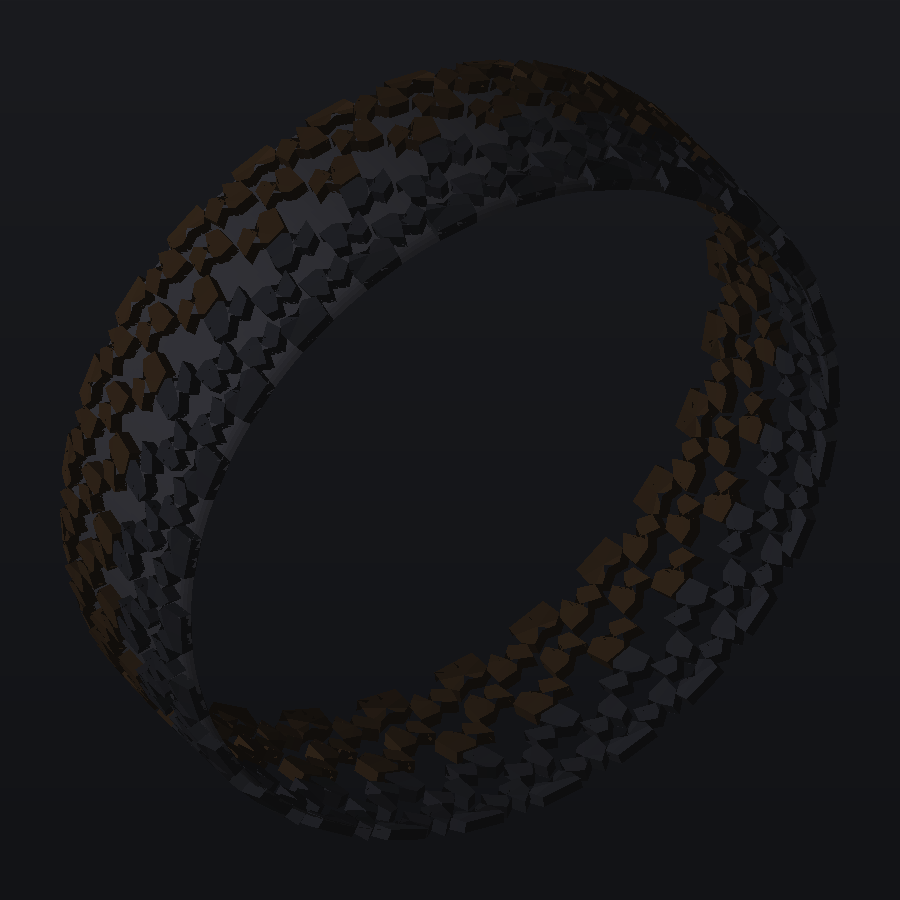

# QuadTread gallery

Proof renders for every design shipped by `References/QuadTreadModelling.html` —
the pure-quad tyre-tread modelling reference (one pattern authored per pitch,
aligned onto the wheel, circular array, mirrored halves bridged across seams).

- `<design>-flat.png` — the authored pitch unrolled flat (two tiles shown, mirrored half tinted).
- `<design>-wheel.png` — the finish-quality build wrapped onto the wheel profile.

<figure>
  
</figure>

## Regenerate

```bash
node Exhibits/Workbench/Tyre/QuadTreadDesignsAudit.mjs --proofs
```

The audit builds every design with the same geometry core that the HTML tool
pipelines into the browser, checks topology (pure quads, sealed edges,
manifoldness, degenerates) and lints the traced-polygon authoring rules,
then re-renders the PNGs into this folder with a small software z-buffer
(no GPU needed).

## Audit table

| design | kind | quads | copies | rim | stray | nonMan | degen | nonQuad | lint |
|---|--:|--:|--:|--:|--:|--:|--:|--:|--:|
| vortexTrace | traced | 43056 | 2 | 1012 | 0 | 0 | 0 | 0 | 0 |
| terraTrace | traced | 36680 | 1·A/B | 1120 | 0 | 0 | 0 | 0 | 0 |
| helixTrace | traced | 38808 | 2 | 968 | 0 | 0 | 0 | 0 | 0 |
| apexTrace | traced | 56472 | 1 | 1040 | 0 | 0 | 0 | 0 | 0 |
| frostTrace | traced | 72480 | 2 | 960 | 0 | 0 | 0 | 0 | 0 |
| armorTrace | traced | 36972 | 2 | 1196 | 0 | 0 | 0 | 0 | 0 |
| latticeTrace | traced | 36660 | 2 | 1140 | 0 | 0 | 0 | 0 | 0 |
| clawTrace | traced | 36000 | 2 | 1200 | 0 | 0 | 0 | 0 | 0 |
| touringTrace | traced | 53128 | 2 | 928 | 0 | 0 | 0 | 0 | 0 |
| road | lane | 103880 | — | 2940 | 0 | 0 | 0 | 0 | 0 |
| ht | lane | 56448 | — | 1344 | 0 | 0 | 0 | 0 | 0 |
| winter | lane | 137808 | — | 4032 | 0 | 0 | 0 | 0 | 0 |
| at | lane | 79440 | — | 2160 | 0 | 0 | 0 | 0 | 0 |
| wet | lane | 69948 | — | 1972 | 0 | 0 | 0 | 0 | 0 |
| aqua | lane | 72904 | — | 1976 | 0 | 0 | 0 | 0 | 0 |
| gt3 | lane | 29184 | — | 912 | 0 | 0 | 0 | 0 | 0 |
| drag | lane | 37000 | — | 1000 | 0 | 0 | 0 | 0 | 0 |
| semi | lane | 32000 | — | 1040 | 0 | 0 | 0 | 0 | 0 |
| offroad | lane | 44200 | — | 1496 | 0 | 0 | 0 | 0 | 0 |
| mud | lane | 41568 | — | 1392 | 0 | 0 | 0 | 0 | 0 |
| sand | lane | 24672 | — | 1088 | 0 | 0 | 0 | 0 | 0 |
| rally | lane | 62216 | — | 1936 | 0 | 0 | 0 | 0 | 0 |

**22 designs — 0 mesh defects, 0 lint warnings.**

## Authoring conventions enforced by the lint

1. **Traced polygons never overlap** — not between authored blocks, not at the
   v+1 pitch seam, and not against their mirrored copies (point/axis mirrors are
   resolved before the check). Overlapping lug solids z-fight and corrupt
   tessellation; keep a real groove between neighbours.
2. **One parallel sipe family per block.** Crossing sipes create coincident
   junction vertices at corridor crossings: degenerate zero-length edges,
   scrambled edge tags, orphaned fan faces (thousands of dangling edges), and
   the junction risers are topologically non-manifold by construction. Keep the
   sipes of a block parallel and fan them with `off` instead.
3. **Keep sipe corridors off reflex vertices.** A corridor that grazes a concave
   polygon vertex produces slivers and dangling fan edges — shift the whole
   family with `off` until it cuts through the thick part of the lug
   (swept numerically: ±8 mm fan on the helix vane is watertight).
4. **Sculpted lug tops (`apex`) must clear the shallowest sipe floor.** Blocks
   may carry an authored apex function (per-vertex mm dip below the running
   surface — `AX.ramp` / `AX.wedge`; claw shoulders run a 2.8 mm shed ramp,
   armor shoulders 2.2 mm, helix vanes a 1.8 mm directional wedge). The dip is
   lint-capped at `min(sipe floor) − 0.7 mm` / `0.45 × depth` so wall level
   grids stay uniform and every column remains conforming. Sipe floors always
   stay planar; chord midpoints stay 3-D lerps, so sculpted and flat pieces
   share coordinates exactly.
