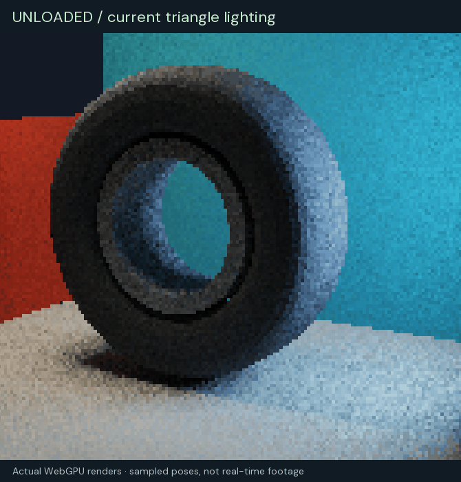
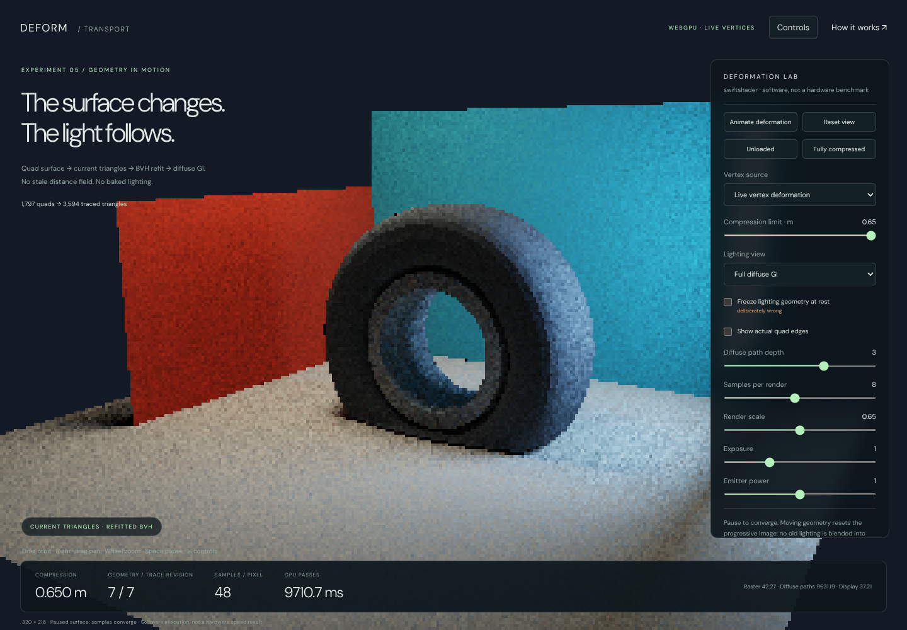
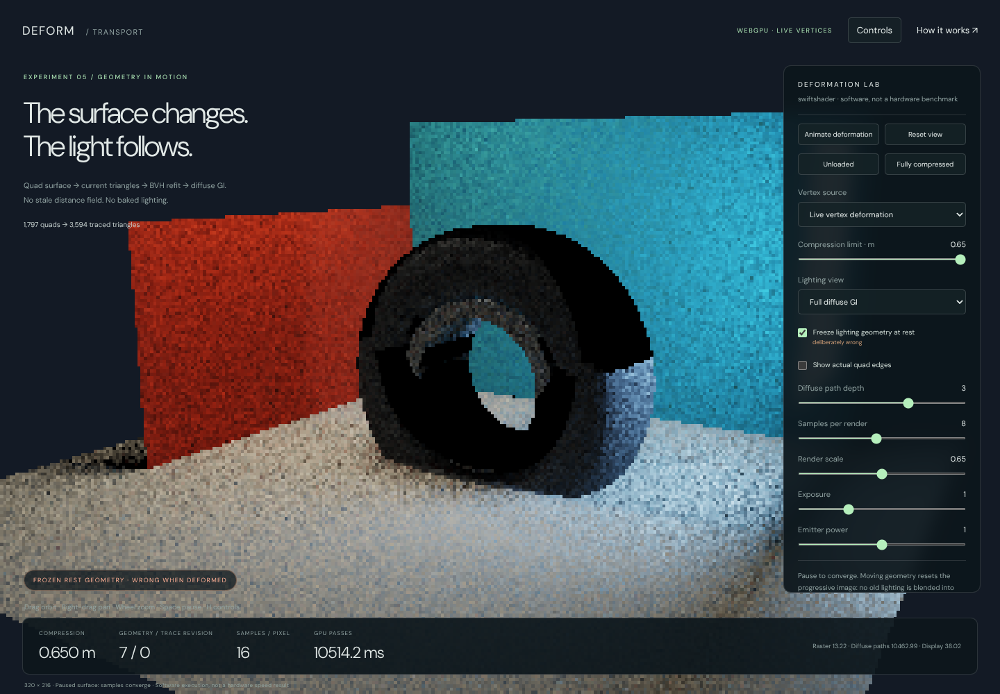

# Deforming triangles, current GI

**5 October 2026 · C037 · Native WebGPU demonstration**

[Open the demo](../Experimental/DeformationIntegrator/index.html) ·
[Read as a webpage](DeformationTransportReview.html)



The animation above alternates captured poses. It is **not a real-time performance recording**.

## The answer for your car and tyre surfaces

You can get GI from a deforming quad surface without converting that surface to an SDF. The lighting needs the
**current vertex positions**, a consistent triangulation, current normals and acceleration bounds containing the
changed triangles. It does not need to know whether the positions came from VAT playback, XPBD or another solver.

This demo exercises that path. The rubber tyre has **1,536 shared vertices and 1,536 quads**. Including the rigid
open rim and lighting environment, the scene contains **1,797 quads / 3,594 triangles**, traced through **2,047 BVH
bounds**. The deformation changes local edge lengths and normals, not just a rigid transform. Maximum tested tyre
edge-length change is approximately **57.2 mm** in this deliberately enlarged demonstration scene.

The tyre motion is a controlled non-rigid compression, **not a calibrated XPBD tyre simulation**. Your native tyre
solver and vehicle code are not modified or integrated by this experiment. A separate external-position path is
provided and verified with a localized deformation that does not come from the demo's VAT.

## Try this comparison

1. Open the demo in a WebGPU-capable browser. Drag to orbit, right-drag to pan and scroll to zoom.
2. Click **Unloaded**, then **Fully compressed**. These stop the animation and set a reproducible pose.
3. Let the sample count increase while paused. The image is deliberately a progressive, noisy path-traced result.
4. Enable **Show actual quad edges** to see the changing surface connectivity rather than a displaced texture.
5. At full compression, enable **Freeze lighting geometry at rest**. The visible tyre stays deformed, but shadow
   and bounce rays now intersect its old shape. The false dark shell makes the synchronization error obvious.
6. Disable that comparison and select **Indirect only** to isolate bounced illumination.
7. Select **Recorded vertex texture · VAT**. Interpolated vertex positions enter the same triangle/refit/lighting
   sequence. The lighting is still calculated at runtime; it is not recorded into the animation texture.
8. Use **Animate deformation** or Space to resume. H toggles the compact controls.





## What runs on the GPU

```text
Live vertex deformation OR sampled VAT OR externally supplied positions
    → expand the fixed quad diagonals into current triangle coordinates
    → recompute geometric triangle normals
    → refit leaf bounds from those triangles
    → refit internal bounds, deepest level to root
    → rasterize the same current triangles
    → trace shadow and diffuse-bounce rays against those triangles
    → accumulate only while geometry, camera and lighting remain unchanged
```

The GPU deformation and expansion dispatches precede bottom-up refit dispatches in the command sequence. The refit
covers all eleven BVH depths. Rasterization and transport follow those writes. No CPU readback is needed between
deformation and lighting. When the pose is unchanged, deformation and refit are skipped; image sampling continues.

The initial triangle ordering and connectivity stay fixed. **Refit changes the bounds, not the BVH partition.**
That is sufficient for correct traversal as long as the bounds remain conservative. For substantial crumpling,
refitted bounds may overlap more and tracing may slow down; periodically rebuilding the partition becomes useful.
If a panel tears, gains triangles or changes connectivity, replace/rebuild the corresponding acceleration structure.
That topological-change path is not implemented here.

Quads are split with a stable diagonal. Both rasterization and tracing use the exact same two triangles. A warped
non-planar quad does not define a unique planar surface: consistency of that diagonal matters. This demo uses flat
geometric triangle normals, rather than pretending the quad is an exact smooth patch.

## Live deformation versus VAT

**Live:** a GPU compute shader changes the tyre positions using a strictly increasing vertical compression warp
and positive lateral scale factors. The inner bead follows the axle; the lower casing compresses and bulges.
Unlike a hard ground clamp, the continuous deformation does not collapse the lower volume onto one plane.
This is a geometric exercise, not a pressure-, stiffness- or volume-calibrated material simulation.

**VAT:** seventeen poses are generated at startup and stored in a real `rgba32float` GPU texture, 64 by 408 texels.
The shader fetches the two adjacent vertex poses and linearly interpolates each position. Normals and bounds are
then recomputed from that interpolated surface, not blended from stale bounds. At the tested intermediate
compression of 0.373 m, the largest component difference from the live deformation is **0.126 mm**. That is one
measured pose, not a guaranteed bound for arbitrary animation clips.

The recorded texture is about **408 KiB** of vertex positions. More complex motion may need more samples or a
better animation representation. It contains no GI, shadow, ambient-occlusion or surface-colour images.

**External positions:** `DeformationApp.SupplyPositions(positions)` accepts one XYZ or XYZW world-space position
per tyre vertex, in the original connectivity order. It selects the external source and pauses procedural motion;
the following render expands and refits the supplied positions. Wrong counts and non-finite coordinates are refused.
This CPU-array upload is suitable as an integration point for a CPU solver. A GPU XPBD solver could instead write
the position storage directly before expansion; that GPU-solver integration is not supplied by this demo.

## Why the lighting is a path tracer this time

The previous atrium demonstrated radiance cascades. Here the immediate question is whether the changing surface
can be lit correctly, so the demo deliberately uses a **finite-depth diffuse path tracer** rather than adding
cascade-interpolation error to the comparison.

- Two actual emissive rectangles provide lighting. Their areas, positions and radiances match the sampling model.
- Every surface vertex of a camera path samples one of those rectangles with its selection probability included.
  Shadow visibility is a triangle BVH ray, not a shadow map or an SDF approximation.
- Further directions are sampled with a cosine-weighted hemisphere. For a Lambertian BRDF, the throughput factor
  after dividing by that sampling density is the surface albedo.
- Emitter hits after a diffuse sample are terminated without adding emission a second time: explicit light sampling
  already estimates those paths. Directly visible emitters still contribute their emission.
- The default path depth of three includes direct lighting and up to **two diffuse interreflections**. Depth one
  removes the indirect contribution. There is no environment illumination; the display background is not a light.
- No spatial denoiser or motion-history reuse hides incorrect geometry. A pose, camera, source-power, tracing-mode
  or path-depth change resets accumulation. Paused images accumulate additional samples.

At finite samples the result is noisy. At finite depth it omits longer light paths. Millimetre-scale ray offsets,
floating-point arithmetic, flat shading, raster coverage and display tone mapping are additional approximations.
This is a correctness-oriented reference demonstration, **not an exact infinite-bounce solution or production GI**.

## Executed checks

The verification scripts run actual WebGPU commands, read back deformed vertices, expanded triangles and refitted
bounds, and compare them with independent CPU calculations. The browser did not render these images on the CPU.

| Check                                  | Executed result                                              |
| -------------------------------------- | ------------------------------------------------------------ |
| Quad topology                          | Tyre edges have two incident quads; stable shared vertices    |
| Geometry sweep                         | Nine poses; finite normals and positive triangle areas       |
| Minimum tested triangle area           | 0.000270846 square metres                                    |
| GPU positions versus CPU deformation   | Maximum component error 2.59e-7 m                             |
| GPU current-triangle ray queries       | 960 queries across five live/VAT/external configurations      |
| GPU ray distance versus brute force    | Maximum absolute error 1.319e-5 m                             |
| Refitted bounds                        | Every leaf contains its triangles; all internal bounds valid |
| Frozen rest geometry at full load      | 134 of 192 reference ray distances disagree by over 1 mm      |
| Independent area-light integration     | 20 receivers × 64 samples; maximum RGB error 5.58e-8          |
| Shadow-ray exercise in that comparison | 601 of 1,280 light samples occluded                           |
| Full = direct + indirect               | Maximum component discrepancy 1.42e-7                        |
| Emitters off                           | All measured surface RGB exactly zero                       |
| Indirect view with depth one           | All measured surface RGB exactly zero                       |
| Frozen versus current indirect light   | Mean absolute RGB difference 0.002618                        |
| Accumulation                           | Unchanged poses accumulate; changed poses reset              |
| Browser/UI                             | Animation, VAT, external input, scale, mobile, refusal pass   |

The independent area-light comparison derives area, normal and emission from the actual CPU scene quads, computes
the Lambertian solid-angle factor, and brute-force tests every shadow ray against triangles. It does not merely
compare the shader with another invocation of the same shader. GPU ray-oracle queries include axis-parallel rays.

These numerical results demonstrate the tested geometry/visibility/lighting calculations, not general accuracy
bounds for every mesh or a comparison against an independent full multibounce reference renderer. No complete
self-intersection or tyre-material calibration study is claimed. The continuous warp is injective; the tests check
the sampled triangle areas and normals, not a universal guarantee for arbitrary supplied solver positions.

At the fixed camera and 16 samples per pixel, the mean surface RGB is **0.339468** for full lighting, **0.328731**
for direct lighting and **0.010738** for indirect lighting. These are linear HDR RGB means, not photometric luminance.
Frozen tracing changes indirect lighting even though the rasterized current geometry is held identical.

## Performance: measured, not inferred

The available adapter is **SwiftShader software Vulkan/WebGPU**, running Chromium 133. It establishes successful
execution but does not establish hardware real-time performance.

Three warmed, changing-pose renders at **320 by 216**, one sample per pixel and path depth three recorded GPU-pass
sums of **1,302.63, 1,314.90 and 1,297.79 ms**. Across those samples, vertex/triangle preparation plus BVH refit took
**0.83–16.96 ms** in software; diffuse-path integration dominated. These are observations from this sandbox, not
projections for a gaming GPU. The pass sums exclude CPU overhead, buffer uploads outside the measured intervals,
query readback and browser compositing. Higher samples per render increase execution time substantially.

The renderer permits one render in flight and waits for completion before reusing its timing readback. This is
simple and testable, not an optimized overlapping production scheduler. Default display resolution is capped at
800 by 600; validation screenshots use a deliberately low internal resolution and retain visible aliasing/noise.
Hardware benchmarks, adaptive sampling, temporal rejection, denoising, better scheduling, specular transport and
large-scene acceleration are future work, not completed features.

## How this fits an SDF renderer

A production hybrid can retain SDF tracing for the static world and use updated triangle structures for deforming
surfaces. A ray queries both representations and shades the nearest valid hit. A shadow ray is blocked if either
representation blocks it. The resulting material/radiance evaluation must be shared so both participate in the
same light-transport calculation.

That is a design direction, not a claim that this browser demo is wired into your native SDF renderer. It also does
not establish that triangles are always faster than dynamic SDF updates. The point demonstrated here is narrower:
**you do not have to approximate the animated tyre with a stale field to let it participate in GI**.

## Reproduce and inspect

- Application: `Frontier/Experimental/DeformationIntegrator/index.html`. Serve over HTTPS or localhost; no build step.
- CPU geometry checks: `node VisualProof/DeformationIntegrator/VerifyGeometry.mjs`.
- Browser checks: `VisualProof/DeformationIntegrator/VerifyWebGpu.cjs`, using Playwright 1.63 and
  Sparticuz Chromium 133.
  Run the CPU checks first, serve the repository root on port 8080, and expose the installed packages with `NODE_PATH`.
- The browser verifier's software launch removes `--in-process-gpu` and `--single-process`, enables Vulkan/SwiftShader
  WebGPU, and uses `/tmp/vk_swiftshader_icd.json`. These are sandbox verification settings, not user requirements.
- `?manual=1&width=320` selects manual rendering and a fixed requested internal width. `DeformationApp.Step(load)`
  executes a pose; `Readback()` returns linear HDR pixels, and `ReadResource()` supports GPU-geometry inspection.
  Use the manual URL for deterministic verification. Changing topology requires more than supplying new positions.
- Actual captures and source-hashed reports: `VisualProof/DeformationIntegrator/Captures/`.

The previous radiance-cascades atrium, native XPBD tyre and other approved experiments remain unchanged.
