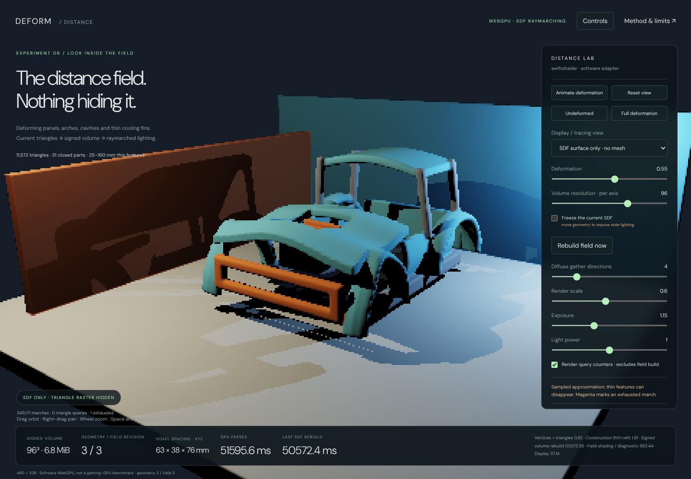
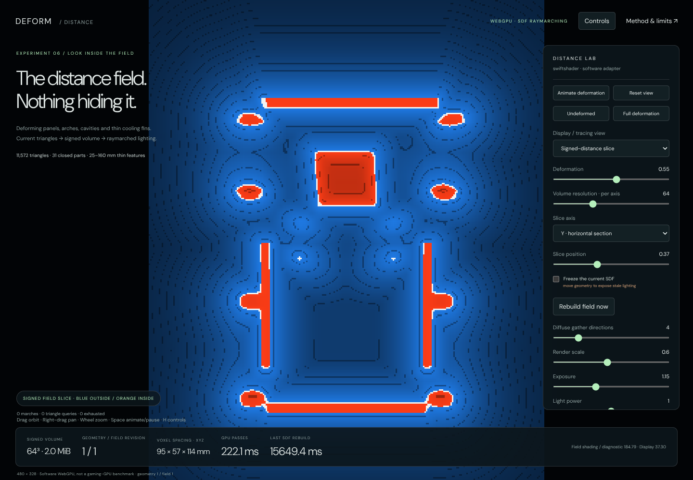
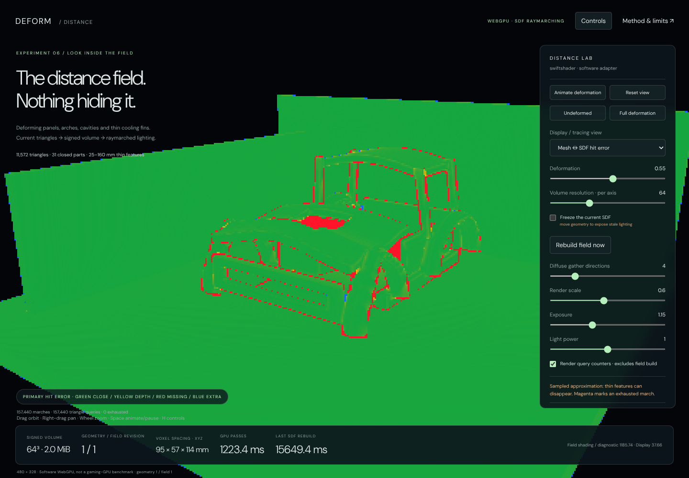

# Deforming geometry → signed distance field → GI

**5 October 2026 · C038 · Native WebGPU investigation**

[Open the corrected SDF demo](../Experimental/DistanceIntegrator/index.html) ·
[Webpage version](DistanceTransportReview.html)

## First, the correction

The preceding tyre demo traced **triangles**. There was no SDF hidden behind that mesh. Its progressive diffuse
path tracer was a geometry/lighting reference, not the requested SDF-raymarching implementation. This new,
separate demo corrects that mismatch. The previous tyre demo remains available and unchanged as a reference.

The default view is now **SDF surface only**. It does not issue a triangle raster pass. The vehicle-style assembly
is displayed by raymarching a signed volume rebuilt from its current deformed triangle surfaces.



## Is progressive path tracing better than our ReSTIR?

**No such conclusion follows from these demos, and replacing the native ReSTIR renderer is not recommended.**

Path tracing describes transport along light paths. ReSTIR is a family of reservoir-based sample-resampling and
reuse techniques; it is not a competing geometry representation. SDF raymarching describes how a ray finds a
surface or tests visibility. These choices can be combined.

The checked native source, `Frontier/Engine/Shaders/ViewportIntegrator.slang`, already has separate direct-light
and GI reservoir storage and temporal/spatial GI reuse. `ReSTIRViewport.slang` includes that shared implementation.
Adding a second progressive renderer is therefore not necessary just to make animated geometry contribute to GI.
A small reference tracer can remain useful for development comparisons, but it should not be mistaken for an
upgrade over the production reuse scheme.

The relevant integration work is to provide **current SDF hit/visibility information** to the existing lighting
calculation. Reused samples need current visibility/target evaluation and appropriate rejection when geometry,
surface identity or the field changes. ReSTIR cannot recover a thin panel that is missing from the field, and
reusing an invalid old visibility result can preserve incorrect lighting.

The older prototype's apparent speed was not an equivalent benchmark against the native renderer: different
scenes, material models, lights, resolutions, sampling and hardware were involved. The captured-pose GIF was not
a real-time recording. This delivery still has **no gaming-GPU benchmark**.

## What changed in this demonstration

- **11,572 triangles / 5,786 quads / 5,852 vertices** in a procedural vehicle-bodywork stress scene.
- **31 individually closed components:** crowned hood panels with a real central opening, four curved wheel arches,
  cabin roof and pillars, lower side panels, rails, an open grille surround, a rear bulkhead, an engine casing,
  six thin cooling fins, diagonal braces and a thin undertray.
- Non-rigid front compression, lateral expansion and panel buckling. Vertices, normals and triangle bounds change.
  This is a controlled deformation, not a calibrated crash or XPBD simulation.
- The **35 mm cooling fins** and **25 mm undertray** deliberately challenge field resolution. The thicker body
  panels are approximately 130–160 mm in this enlarged study; they are not realistic sheet-metal gauges.
- Actual **mesh-derived signed-volume construction on the GPU**, not a hand-authored analytic SDF for the car.
- **Single-frame, one-bounce diffuse gathering** with SDF shadow and bounce rays. There is no progressive image
  accumulation, recursive multibounce renderer or ReSTIR reuse in this browser study.
- A triangle reference uses the same point lights and diffuse-direction quadrature for comparison. It is not the
  default lighting path and does not silently replace failed SDF traces.

This is more demanding than the tyre, but it is still a bounded synthetic assembly, **not validation on your
production car asset, arbitrary open/nonmanifold meshes, tearing geometry or an open world**.

## The debug views are not hidden behind the mesh

| View                         | What is actually displayed                                                |
| ---------------------------- | ------------------------------------------------------------------------- |
| SDF surface only             | Raymarched field surface with direct field-shadowed lighting; no raster    |
| SDF gradient normals         | Normals from distance-field finite differences; no raster                  |
| Signed-distance slice        | X/Y/Z section: blue outside, orange inside, white near zero, cell contours |
| Mesh ↔ SDF hit error          | Primary-ray depth/hit comparison, independent of mesh rasterization        |
| Sphere-tracing step cost     | March counts; magenta explicitly marks iteration-budget exhaustion        |
| Raster + SDF one-bounce GI    | Detailed visible triangles; all shadow/bounce queries use the field        |
| Indirect only                | Only the one-bounce field-gather contribution                              |
| Triangle reference GI        | Same simple lighting estimator with actual triangle queries               |
| Mesh normals + quad edges    | The actual deformed source surface, not a distance-field reconstruction    |
| Raster direct only           | Same raster receivers, with only direct SDF-shadowed lighting              |

**Error colours:** green is close; yellow increases toward two largest-axis voxel spacings of depth difference.
Red means no field hit or a field hit more than two voxel spacings behind the triangle hit. Blue means an extra
field hit or one more than two spacings in front. Magenta means the field marcher exhausted its iteration budget.
Green is therefore not an exact-equality certificate, and the thresholds change with the voxel spacing.





Try **Undeformed / Full deformation**, then switch between surface, slice and error views. Freeze the current SDF
and move the geometry to expose stale-field errors. **Rebuild field now** forces a fresh volume even while frozen.
Changing volume resolution also allocates/rebuilds a new field. Drag to orbit, right-drag to pan, wheel to zoom;
Space toggles deformation and H hides controls. Animation starts paused so the initial field is inspectable.

## Construction and tracing

The geometry preparation sequence is:

```text
Current vertices → expanded triangles/normals → refitted construction BVH
    → component bounds → per-voxel distance and inside classification
    → signed 3D texture → sphere-traced visibility and diffuse gather
```

The fixed-topology BVH has **8,191 bounds, depth 12**. Nearest-distance queries traverse nearer bounds first and
prune by squared distance. Per-bound component membership and freshly computed component AABBs prune sign queries.
A 32-entry local traversal stack is adequate for this checked topology; the constructor rejects excess depth.

At a voxel position, the GPU computes triangle distance and ray-crossing parity for the closed components. A
32-bit parity mask keeps their classifications separate, so overlapping components do not cancel as they would
under one undifferentiated odd/even count. Component signed distances are combined by CSG minimum. This gives the
union's sign and zero surface; inside overlapping solids it is not necessarily the exact Euclidean distance to
the union boundary. The scene is limited to 32 closed components by this representation.

The stored volume is `rgba16float`: signed distance, material identifier, component identifier and a written marker.
Distance is trilinearly sampled; material lookup uses a nearest voxel. Normals use finite differences. The sampled
dynamic volume occupies **2 MiB at 64³**, **6.75 MiB at 96³**, or **16 MiB at 128³**; these are payload sizes, not total
GPU-resident memory. The static floor and two room panels use analytic box SDFs matching their raster geometry.

The marcher uses a 0.75 distance-step factor, a small minimum step, a voxel-relative hit tolerance, sign-crossing
refinement and a 256-iteration limit. These are practical numerical choices, **not a certified intersection guarantee
for an arbitrary trilinear field**. Shadow-ray exhaustion fails dark; missed/exhausted bounce rays contribute no
bounce. Primary diagnostic exhaustion is coloured magenta rather than hidden.

The one-bounce gather uses a fixed cosine-weighted direction pattern and evaluates direct point lighting at the
hit surface. It is a low-sample approximation with visible directional/banding error. It is not a converged
radiometric solution, a surface-lighting cache, a denoiser or ReSTIR. The SDF lighting path uses a 0.7-voxel origin
bias to limit self-occlusion; the triangle reference uses 2 mm. Their images therefore differ in normal/material
reconstruction and ray bias as well as intersection geometry.

## What was actually verified

`VerifyStructure.mjs` checks the 31 component edge incidences, BVH leaf coverage, field-domain containment, finite
normals and positive triangle areas at five poses. The smallest tested triangle area is **0.00115688 m²**. The
largest tested vertex displacement is **1.06727 m**. This is not a complete arbitrary-mesh self-intersection audit.

`VerifyWebGpu.cjs` executes the actual WGSL, reads back vertices and every stored voxel, and compares sampled field
locations against an independent CPU closest-point/parity calculation. The CPU closest-point routine uses triangle
Voronoi regions, rather than copying the GPU's plane/edge-distance calculation.

- Four volumes: 32³, 64³ and 96³ at deformation 0.55, plus 64³ at deformation 1.
- All written voxels finite, all written markers present, and both negative and positive samples present.
- **96 selected voxel positions**, covering inside, near-surface and distant samples, agree with the independent
  calculation within **0.487 mm maximum absolute error**. This includes half-float storage error. It is accuracy
  **at those sample positions**, not a bound on the reconstructed surface between voxels.
- GPU deformation differs from the double-precision CPU formula by at most **0.0470 mm** in the tested poses,
  including shader trigonometric approximation. Distance/ray oracles use the actual GPU vertices to isolate the
  field/intersection calculations from that deformation arithmetic difference.
- **720 paired GPU field/triangle ray queries** across three resolutions. The triangle query distances agree with
  independent brute-force intersections within **3.25e-6 m**.
- The SDF-GI render records **741,180 marches and zero triangle ray queries**. The reference render records
  **742,381 triangle queries and zero marches**. Counters exclude triangle work used to construct the volume.
- SDF-only views do not issue raster passes. Frozen fields remain byte-identical while the visible geometry changes;
  refreshing the field changes lighting. Returning to the same settings reproduces the HDR image exactly.
- Full/direct/indirect decomposition agrees within **0.001893 RGB**, including separate half-float output rounding.
  Indirect mean RGB is **0.010240** over visible surfaces; light power zero yields exactly zero surface RGB.
- External position injection changes the volume, invalid inputs/static-room edits are refused, and restoring
  procedural positions exactly reproduces the original volume. Animation updates geometry and field revisions
  together. Scale controls, mobile layout and explicit no-WebGPU refusal pass without recorded browser errors.

### Field fidelity: include the failures, not just the median

The fixed ray set contains **168 triangle-reference body hits** among 240 rays. A missing-body result means the
field ray misses the body entirely or instead reaches the static room. A matched-body result can still hit the
wrong body surface farther along the ray, so its depth error must also be reported.

| Resolution | Missing body / 168 | Extra body | Matched median | Matched mean | Matched p95 |
| ---------- | ------------------ | ---------- | -------------- | ------------ | ----------- |
| 32³        | 48                 | 1          | 18.48 mm       | 172.68 mm    | 1,929.48 mm |
| 64³        | 8                  | 0          | 5.52 mm        | 91.49 mm     | 497.25 mm   |
| 96³        | 6                  | 0          | 2.88 mm        | 69.49 mm     | 30.58 mm    |

The matched medians improve, **but thin-feature and farther-surface failures remain**. The full-screen 64³ GI render
also exhausts the march budget on **539 of 741,180 queries**; those failures are handled as described above, not
silently replaced with triangle tracing. This does not establish production-quality GI for complex thin car panels.

## Rebuild cost must not disappear from the comparison

All timings below are **Chromium 133 / SwiftShader software Vulkan-WebGPU**, not gaming-GPU measurements. The HUD
retains **Last SDF rebuild** separately, even when an unchanged scene reuses its volume.

| Measured work                                           | Software GPU interval |
| ------------------------------------------------------- | --------------------- |
| 32³ construction, deformation 0.55                       | 2,138.42 ms           |
| 64³ construction, deformation 0.55                       | 15,649.39 ms          |
| 64³ construction, deformation 1                          | 16,642.37 ms          |
| 96³ construction, deformation 0.55                       | 50,572.36 ms          |
| Reused-field GI render, 480 × 328, four directions       | 2,227.19 ms total     |
| Triangle-reference GI, same size/direction count         | 5,669.37 ms total     |

These are individual executed samples with instrumentation enabled, not hardware throughput statistics. The
render totals cover measured raster/compute/display intervals, not browser compositing, CPU work or readback.
The two representations do not produce equal-quality images, so the ratio is not an equal-quality speedup claim.

**The finished field is cheaper to query here, but rebuilding this dense field dominates a changing scene.**
A reused-field timing is not the cost of dynamic SDF GI. This is a correctness/diagnostic construction route,
not a production update strategy, and these results are not a comparison against the native ReSTIR renderer.

## What this means for the actual renderer

Keep ReSTIR as the sampling/reuse component. Decide separately how changing geometry supplies reliable visibility:

- Profile dynamic **per-object fields or dirty bricks**, not a full uniform volume rebuild for every pose. Updating
  moving geometry must cover both its old and new affected extents, with explicit validity/version tracking.
- For suitably constrained motion, investigate inverse-warping a local rest-pose field with corrected distance
  bounds. Arbitrary crumpling may not have a usable inverse. This demo rebuilds the field; it does not implement
  inverse-warped queries or demonstrate their accuracy.
- Investigate surface voxelization plus distance propagation/narrow-band updates when full nearest-triangle queries
  are too expensive. Validate signs and conservative stepping, not just construction speed.
- Use smaller local domains/adaptive resolution for thin parts. At 64³ this volume has approximately **95 × 57 ×
  114 mm** spacing; at 96³ it has **63 × 38 × 76 mm** spacing. Real millimetre-scale body sheets will not be reliably
  represented at those spacings. A topology/sign policy for open surfaces is required; this demo uses closed solids.
- If thin features or close-contact lighting need higher accuracy than the field can provide, retain a selective
  accurate representation for those queries, or knowingly accept/thicken the proxy. Do not call either choice exact.
- Reject or reevaluate reused lighting when field changes invalidate it. Motion vectors, hit identity and geometric
  confidence matter; merely retaining old reservoirs is not sufficient.
- Benchmark representative deformations and materials on the target GPU before choosing the update strategy.

No native ReSTIR, SDF, XPBD, vehicle asset or approved experiment was modified by this browser demonstration.

## Reproduction and files

Application: `Frontier/Experimental/DistanceIntegrator/index.html`, served over HTTPS or localhost, without a build
step. `?manual=1&width=480` enables deterministic stepping through `DistanceApp.Step(amount)`. The position-input API
accepts finite XYZ/XYZW coordinates for the scene vertices; dynamic vertices must stay inside the fixed field domain
and static room vertices cannot move through that input. Topology and closed-component identities remain fixed.

Verification entry points are `VisualProof/DistanceIntegrator/VerifyStructure.mjs`, `VerifyWebGpu.cjs` and
`VerifyControls.cjs`. Browser verification uses Playwright 1.63 / Sparticuz Chromium 133 with the existing software
WebGPU launch configuration. The current source hashes, numerical results and actual screenshots are retained in
`VisualProof/DistanceIntegrator/Captures/`. Full voxel dumps and dependencies remain ignored scratch.
