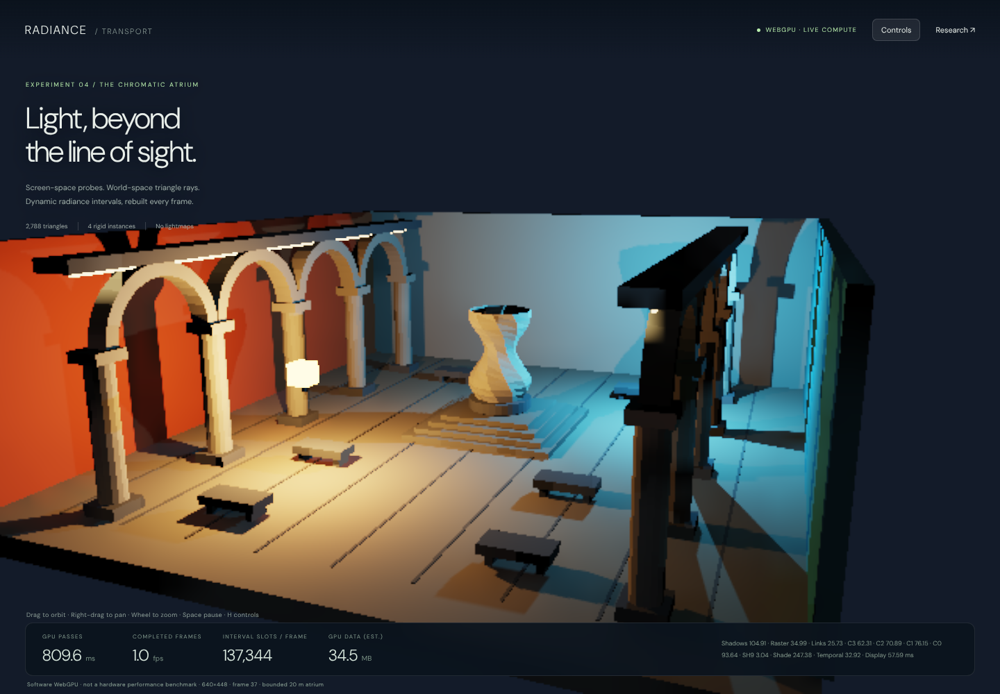

# Radiance Transport — WebGPU implementation and research review

**5 October 2026 · Experimental renderer · C036**

[Open the interactive demo](../Experimental/RadianceIntegrator/index.html) ·
[Read this document as a webpage](RadianceIntegratorReview.html)

## Verdict first

This is an independently implemented, working **WebGPU** radiance-cascades experiment for an original
**2,788-triangle** architectural scene. It has screen-space probe placement, full-scene triangle tracing,
animated lighting and rigid triangle geometry, native raster visibility, quality controls and diagnostic views.
It has no editor outliner, inspector, document tabs or baked lightmaps. The older radiance experiments are unchanged.

It is **not an AAA-ready or open-world renderer**. Real-time operation on a gaming GPU has not been established:
the available execution adapter was SwiftShader software Vulkan/WebGPU. The demo exposes real GPU pass timings
on the adapter running it, rather than substituting CPU submission time or an assumed frame rate.



This is an original atrium and a recreation of the rendering idea, not a pixel-identical copy of Sponza or a port
of the supplied demo's code. Its coarse geometry and low-resolution shading are deliberately inspectable.

## 1. What the references establish

### three-rc

The repository describes 3D radiance cascades with screen-space probes and a full-scene BVH. Its README makes an
important distinction: screen-space **placement** does not require screen-space-only **tracing**. BVH rays can find
off-screen emitters and occluders; the alternative screen-space ray marcher cannot. It also identifies robust
TLAS/material lookup and short-range gather as further work. Those are useful architectural directions, not proof
of scene-independent tracing cost. [1](https://github.com/CodyJasonBennett/three-rc)

The same README explicitly withholds a license and states **all rights reserved**, citing an unlicensable upscaler.
No implementation code, upscaler or Sponza asset was copied from that repository. The new implementation uses
independently written WGSL and original procedural triangle geometry. Existing repository Three.js math and orbit
controls are reused, but **Three.js does not render this demo**. [1](https://github.com/CodyJasonBennett/three-rc)

### Shadertoy lXByRh

The accessible description identifies six cascades, screen-space probes tracing in 3D, hit-point reprojection with
visibility during merging, and temporal accumulation without spatial denoising. It is a useful reference for the
surface-probe approach and for distinguishing world-space ray visibility from screen-space storage.
The page fetch did not expose its actual shader source, so this review relies on the indexed description rather
than claiming a line-by-line source review. [2](https://www.shadertoy.com/view/lXByRh)

Our merge is **not** that implementation: it uses weighted screen-neighbour interpolation and a separate
probe-connection visibility test, not reprojection of individual ray hit points. That difference matters for quality.

### Osborne and Sannikov: radiative-transfer paper

The reviewed theory sections define radiance intervals, spatial/angular scaling, interval merging and the ringing
associated with interpolating sharp opacity transitions. The paper discusses a bilinear correction at additional
cost. It also explicitly separates the number of stored/calculated samples from the actual work required to trace
longer intervals. This is a formal radiative-transfer method, not an AAA graphics-engine performance benchmark.
[3](https://academic.oup.com/rasti/article/doi/10.1093/rasti/rzae062/7929002)

The institutional [paper PDF](https://eprints.gla.ac.uk/343746/1/343746.pdf) was used to read the interval,
interpolation, scaling and artefact sections. The non-LTE plasma model, wavelength transport and iterative atomic
population solver were not ported. This demo instead handles opaque RGB triangle surfaces in vacuum.

## 2. The implemented frame

The application requests `navigator.gpu`, creates a native `webgpu` canvas context and executes WGSL compute and
raster pipelines. Unsupported adapters produce an explicit message; there is **no WebGL or CPU-rendered fallback**.

1. **Update rigid instances.** Four model/inverse matrices describe the static architectural aggregate, rotating
   sculpture and two moving luminaires. Local-space triangle buffers and BLAS nodes are persistent. Moving an
   instance changes the matrices, not a baked image or a CPU-rendered lighting result.
2. **Raster point-light shadows.** Two six-face depth maps cover the whole triangle scene. Comparison sampling
   supplies direct-light visibility at both visible pixels and ray-hit surfaces. A luminaire's own proxy geometry
   is excluded from its shadow map. Maps are reused only when light/caster transforms and map allocation remain
   unchanged; moving lights or the caster invalidate them.
3. **Raster the G-buffer.** World position/instance, normal/roughness, albedo and emission are produced from actual
   triangles with native depth testing. The raster camera does not determine which triangles are traceable.
4. **Compute spatial links.** Each fine probe gets four coarse-neighbour weights. Distance weighting and optional
   BVH-tested connection visibility are calculated **once per probe pair**, then shared across angular samples.
   Repeating this same visibility ray for every direction was unnecessary work and was removed.
5. **Trace and merge cascades, coarse to fine.** Every interval traces into the complete triangle scene through
   stackless, escape-index BLAS traversal. An opaque hit returns source radiance and zero transmittance; an empty
   interval passes the far result through. Four angular children and four spatial neighbours provide the far field.
6. **Project the finest cascade into SH9.** Nine real spherical-harmonic coefficients represent the low-frequency
   diffuse field. This avoids reintegrating every angular sample at every shaded pixel. The Lambertian convolution
   uses factors 1, 2/3 and 1/4 after division by pi.
7. **Shade and gather.** Normal- and plane-distance-weighted probe interpolation reduces mixing across surfaces.
   Direct lighting and visible emission are combined with the cascade diffuse result. An optional extra reflected
   triangle ray adds a mirror-like response; this is not a full rough-GGX specular transport solution.
8. **Reproject history.** Previous view-projection, world position and normal reject incompatible samples. Dynamic
   instance pixels are rejected; a current 3-by-3 neighbourhood clamps accepted history. Moving-light history weight
   is capped at 0.65. History is optional and does not make the cascades themselves static.
9. **Present and measure.** A rational filmic tone curve, gamma encoding and bilinear display resampling produce the
   final image. Timestamp queries cover the major passes where supported. A three-slot asynchronous telemetry ring
   avoids synchronously mapping a buffer on every frame. At most two GPU frames are in flight.

The shadow maps are a speed/quality trade-off: they replace direct-light BVH shadow rays, **not** the GI interval
rays. GI visibility remains world-space triangle tracing, including off-camera geometry.

## 3. Why this is radiance cascades

An interval stores `R = (C, T)`: radiance travelling back toward the receiver, and transmittance through the interval.
For near and far intervals, the implemented front-to-back composition is:

```text
Cmerged = Cnear + Tnear * Cfar
Tmerged = Tnear * Tfar
```

An opaque near hit prevents the farther field from passing through. This is not a collection of ordinary irradiance
probes with a cascade label: the GPU stores directional **range-restricted** intervals, explicitly composes their
radiance/transmittance, increases angular resolution at each level, then integrates the finest merged result.

For level `l`, probe spacing is `p × 2^l` screen pixels and angular width is `n × 2^l` in each of two angular axes.
The angular cells divide longitude and the cosine of polar angle uniformly, giving equal solid angle `4π/N`.
Directional samples quadruple while the number of screen probes approximately quarters. The exact slot count is:

```text
Nl = ceil(W / (p * 2^l)) * ceil(H / (p * 2^l)) * (n * 2^l)^2
```

This is approximately constant **per level** away from rounding and small-grid limits. It is not constant tracing
time, and it is not the same scaling as a three-dimensional grid of probe origins. Ray traversal still depends on
scene bounds, geometry, depth complexity and material evaluation. The final interval extends to the bounded 80 m
trace distance; there is no infinite-world coverage claim.

At the verified 640-by-448 shading resolution, balanced settings allocate:

| Level | Probe grid | Directions / probe | Range, metres | Directional slots |
| ----- | ---------- | ------------------ | ------------- | ----------------- |
| C0    | 54 × 38    | 16                 | 0–1.5         | 32,832            |
| C1    | 27 × 19    | 64                 | 1.5–3         | 32,832            |
| C2    | 14 × 10    | 256                | 3–6           | 35,840            |
| C3    | 7 × 5      | 1,024              | 6–80          | 35,840            |

Total: **137,344 interval slots**, rebuilt on every transport frame. Background probes are skipped. A slot count is
not a measured ray count: optional connection/reflection rays add work while invalid probes remove it.

## 4. The illumination model, precisely

- Static emissive triangle strips and the sky are integrated by cascade rays.
- The two moving luminaire meshes use point-light proxies for direct illumination. Their visible emission is
  excluded from cascade source emission to avoid adding the same direct-light contribution twice.
- A ray hitting a diffuse surface evaluates that surface's directly lit outgoing radiance. Consequently, the
  cascades carry **one diffuse bounce of the point lights**, not converged multibounce transport.
- The view labelled **Indirect only** is the *cascade contribution*. It also includes directly received triangle
  emission and environment light, not exclusively paths with two or more scattering events.
- SH9 and the four-neighbour gather are diffuse approximations. Negative SH reconstruction is clamped. There is
  one material roughness parameter per triangle; the extra mirror ray is a diagnostic approximation, not full PBR.

This distinction is important when comparing with the references. Their stated results and scope should not be
silently attributed to this implementation.

## 5. Controls and diagnostics

Drag to orbit, right-drag to pan and scroll to zoom. **Space** pauses the lighting clock; **H** toggles the compact
control panel. Quality presets change quality settings without resetting light power, animation or debug selection.
The display is responsive; the full scene remains interactive rather than becoming an editor workspace.

- **Render scale:** internal shading resolution, bounded to 960 by 720 with approximate aspect preservation.
- **Probe spacing:** smaller spacing costs more probes; it does not add geometry.
- **Base angular width:** squared to obtain the base ray count; increasing it costs quadratically.
- **Cascade count / first interval:** control the spatial-angular hierarchy and its distance partition.
- **Point shadow map size:** a separate resolution/cost knob for direct-light visibility.
- **Temporal weight:** zero is useful for detecting spatial artefacts without history hiding them.
- **Exposure / emitter power / sky / speed:** inspection and dynamic-light controls, not quality substitutions.
- **Visibility guards / mirror ray / work counters:** independent quality and instrumentation costs.
- **Point-light proxies:** disable these with sky zero to isolate actual emissive-triangle transport.

Diagnostic views include direct-only, cascade-only, normals, albedo, probe tiles, a selected merged directional
atlas, remaining transmittance, primary-ray BVH traversal cost and temporal acceptance. Direct-only and geometric
diagnostics skip unused cascade/SH work. The atlas shows **merged** intervals, not an unmerged raw-shell buffer.

## 6. Executed verification

The final-source tests run actual WebGPU commands and map GPU buffers/textures for comparisons. Screenshots are
browser captures, not offline renderings or generated illustrations.

- **Scene and BVH:** 2,788 finite, nondegenerate triangles; 2,134 nodes; maximum depth 20. Leaf coverage is exact,
  every leaf contains its triangles, and parent bounds contain children. These are traversal checks, not a claim
  that the architectural assembly is a watertight CAD solid.
- **CPU reference:** 512 nearest-hit rays, including axis-parallel directions and two rigid poses, matched an
  independent brute-force triangle loop. Four reference ray distances changed between poses.
- **GPU reference:** the same 512 GPU traces matched brute-force hit distances within **4.08 micrometres maximum
  absolute error** in this metre-scale scene. This is not a general numerical-accuracy guarantee.
- **Interval algebra:** GPU opaque, transparent, additive and partially transmitting fixtures matched the explicit
  front-to-back formula. Readbacks of all four cascades were finite, with transmittance in `[0, 1]` and both open
  and blocked samples present.
- **No fake ambient floor:** with emitter power and sky zero, every visible surface's measured HDR RGB was exactly
  zero. Background presentation colour is excluded using the actual G-buffer surface mask.
- **Replay and dynamics:** changing time changed lighting and geometry; restoring time with history disabled
  reproduced the original HDR result exactly. History accepted stationary surfaces and remained optional.
- **Off-screen test:** all **24 static emissive triangles** were clipped outside the camera frustum. Point proxies
  and sky were disabled. The visible surfaces still received positive cascade lighting; turning emission off
  yielded exactly zero. The isolated image is very dark: this is a measured nonzero contribution, not dramatic
  visual light spill or proof of arbitrary multibounce visibility.
- **UI and resources:** fast/high/extreme settings, actual render-scale reallocation, shadow reuse, mirror rays,
  pause, hide/show, wheel zoom, continuous animation, the two-frame submission bound and 390-by-844 layout passed.
  An intentionally unavailable WebGPU API produced the explicit refusal message.
- **Browser:** Chromium 133, SwiftShader Vulkan through WebGPU. No page/console errors were recorded. The GPU ray
  tests and image-readback assertions would not pass by merely compiling shader strings.

At the fixed validation camera, mean RGB over visible surfaces was **0.128798** with full lighting, **0.114212**
with direct-only lighting and **0.014586** for the cascade contribution. These are linear HDR RGB means, not
photometric luminance or image-quality scores. The isolated off-screen-emission mean was **0.001331**.

Evidence lives in `VisualProof/RadianceIntegrator/Captures/`: fourteen screenshots, the browser report with source
hashes, and the structural report. Verification entry points are `VerifyStructure.mjs` and `VerifyWebGpu.cjs`.
The tests pin an internal resolution for most comparisons, then separately verify the real render-scale slider.

## 7. Performance: what is measured, and what is not

**There is no gaming-GPU benchmark in this delivery.** SwiftShader executes the WebGPU workload in software.
Its timings establish real execution and locate work in this environment; they cannot establish a 30/60/120 FPS
hardware budget, relative GPU-vendor performance, or open-world scalability.

The live HUD separates:

- **GPU passes:** a sum of timestamped raster/compute intervals, not JavaScript submission time. It excludes resource
  copies outside those intervals, queue waiting and browser compositing. Unsupported timestamp queries show `n/a`.
- **Completed frames:** observed completed submissions per wall-clock interval, not the requestAnimationFrame rate.
  Manual verification and screenshot pauses make screenshot FPS unsuitable as a throughput benchmark.
- **Interval slots:** a resource/work budget when counters are disabled. Enabling counters changes the label to
  **measured rays**, and adds atomic instrumentation overhead.
- **GPU data estimate:** explicit buffer/texture payload sizes. It excludes swapchain storage, implementation
  padding, shader/pipeline caches and driver overhead; it is not a GPU-resident-memory query.

The balanced 640-by-448 validation configuration allocates approximately **34.5 MiB** of explicit data, including
twelve 512-by-512 depth faces. Large settings increase this substantially. Shadow-map size and angular width both
have quadratic cost components. Static shadow reuse, shared link visibility, SH projection, early-outs and BVH
traversal are implemented optimizations; their existence alone is not proof of an AAA frame budget.

The final five post-warm-up moving-frame samples, with counters disabled, recorded a median pass sum of
**1,094.15 ms**, ranging from **1,054.32 to 1,169.14 ms**. That is slow software execution,
not a real-time hardware result. Exact per-pass timings and adapter metadata are in `Captures/WebGpu.json`.

| Recorded frame | Software GPU pass sum, ms |
| -------------- | ------------------------- |
| 27             |                   1169.14 |
| 28             |                   1094.15 |
| 29             |                   1096.41 |
| 30             |                   1076.43 |
| 31             |                   1054.32 |

A separate static-camera frame with instrumentation enabled recorded **84,566 rays**, **4,633,529 node visits**,
**300,507 triangle tests** and **21,515 hits**. This includes connection visibility, not just directional interval
slots. The shadow maps were reused for that unchanged frame; its work is not identical to the moving-frame samples.
No projected gaming-GPU timing is substituted for missing data.

## 8. Known quality and architecture limits

1. **Merge approximation.** Screen-neighbour origins are not coincident in world space. Connection visibility and
   distance weights reduce some leaks but do not implement the paper's bilinear correction or the Shadertoy's
   per-hit reprojection. Coarse-probe parallax errors, missing-parent darkening and light leaks can remain.
2. **View dependence.** The probe layout follows visible surfaces. Off-screen triangles are traceable, but there
   is no persistent world-space irradiance field, probe relocation system or distant clipmap coverage.
3. **Angular/spatial under-resolution.** Thin emitters may be missed; SH9 smooths high-frequency diffuse detail.
   Larger ranges with too few directions are not repaired by temporal filtering. Contact lighting can soften.
4. **Limited scattering/materials.** No converged multiple bounces, participating media, translucency, transparent
   shadows, emissive importance sampling, spectral transport or physically complete rough-specular integration.
5. **Raster/image approximations.** Point proxies and biased PCF shadow maps are not finite-area emitter solutions.
   No jittered TAA, MSAA or advanced image upscaler is implemented. The final display uses bilinear resampling.
   Low render scales therefore retain visible stair-stepping and blur.
6. **History.** Reprojection/clamping can still lag moving illumination. Instance/position/normal rejection is not
   a full material/motion-vector reactive mask, and all dynamic instance pixels currently reject history.
7. **Dynamics.** Instances move rigidly. There is no skinning, deforming-mesh BLAS refit, topology editing or GPU
   BVH construction. The local-space BLASes are built on the CPU at startup, not every frame.
8. **World scale.** This is a bounded atrium, not a streaming world. It uses four BLAS roots without a TLAS, a simple
   split heuristic on the longest bounds axis, and half-float G-buffer positions. It lacks origin rebasing,
   residency management, distant lighting, LOD/HLOD, meshlets and scene-scale occlusion culling.

## 9. Recommended AAA/open-world development order

**P0 — Establish a real hardware baseline.** Profile desktop integrated and discrete adapters at target output
resolutions. Record GPU-pass median/p95, CPU submission time, sustained completed-frame rate and allocation peaks.
Sweep camera paths, emitter sizes, direction counts, thin walls and dense occlusion. Add a path-traced reference
for error measurements; the current dark/replay/visibility tests are not an image-accuracy benchmark.

**P1 — Make scene representation scale.** Introduce reusable per-asset BLASes, an instance TLAS and GPU refit/update
paths. Add geometry/material residency, frustum/occlusion culling and clustered draw submission. A 2,788-triangle
room is much too small to justify claims about million-triangle worlds or thousands of moving instances.

**P2 — Make coverage persistent.** Evaluate camera-relative world-space cascades or a screen/world hybrid, with
clipmap scrolling, distant radiance, validity tracking, scene epochs and error-budgeted updates. Implement world
origin rebasing before treating half-float world positions as suitable for kilometre-scale scenes.

**P3 — Fix transport error before hiding it.** Compare corrected interval interpolation and hit-point reprojection
against the current merge. Add short-range contact gather, thin-surface tests, better probe placement and material
rejection. Evaluate emissive-source sampling and multibounce feedback with explicit energy/stability tests.

**P4 — Budget remaining costs.** Profile coherent ray ordering, work compaction, directional pre-averaging,
visibility reuse, adaptive probe density, temporal reservoirs where justified, and shadow update scheduling.
Select techniques based on measured bottlenecks; combining every named technique is not automatically faster.
This WebGPU implementation uses compute traversal, not hardware DXR/Vulkan-RT ray-query instructions.

**P5 — Production robustness.** Add resource eviction, device-loss recovery, warm-up/pipeline caching strategy,
streaming stress tests and browser/vendor coverage. Keep unsupported-device behaviour explicit. Promote this
experiment only after measured image error and hardware frame budgets hold under representative workloads.

## 10. Files and reproducibility

- `Frontier/Experimental/RadianceIntegrator/index.html`: static entry point; serve over HTTPS or localhost.
- `RadiancePanel.js` / `.css`: native WebGPU orchestration, input, compact HUD and asynchronous telemetry.
- `SceneSpecification.js`: original geometry, local BLAS packing and cascade layouts.
- `TransportIntegrator.js`: independently authored WGSL stages, interval composition and traversal.
- `VisualProof/RadianceIntegrator/VerifyStructure.mjs`: dependency-free CPU structural/reference checks.
- `VisualProof/RadianceIntegrator/VerifyWebGpu.cjs`: Playwright execution and mapped WebGPU assertions.

No package installation is required to use the hosted demo. Browser verification uses Playwright 1.63 and
Sparticuz Chromium 133 in ignored scratch. The software test launch removes in-process GPU/single-process flags
and enables Vulkan/SwiftShader WebGPU; these are **test-environment flags**, not requirements to impose on users
with a supported hardware WebGPU browser. The normal demo does not request an unsafe browser mode.

The implementation and all evidence are separate from the older WebGL experiments. The research links are
acknowledgements and design references, not a claim that this renderer reproduces their numerical accuracy,
performance, exact shaders or licensing terms.
