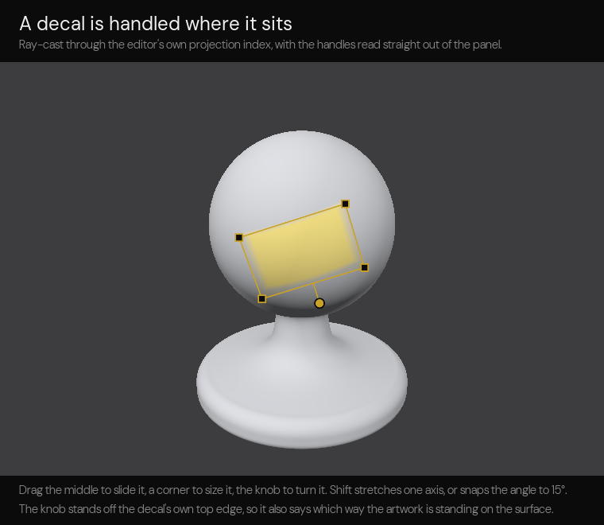
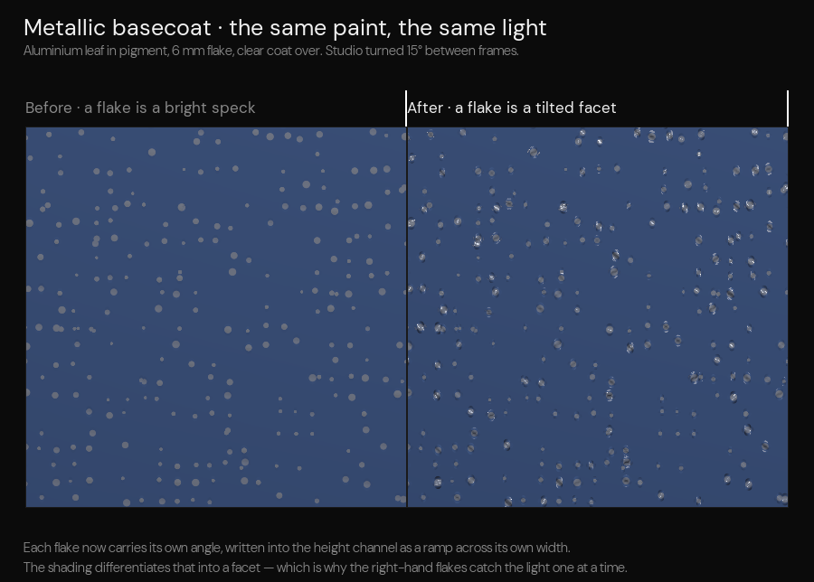
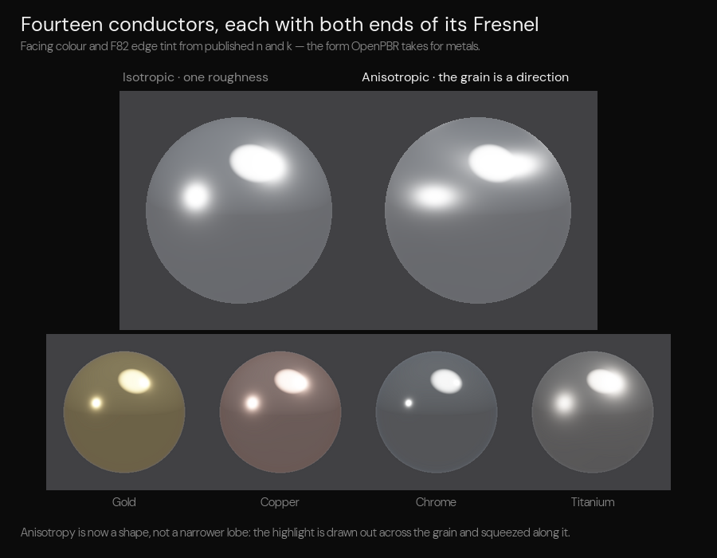

# Frontier Texture

An experimental, browser-resident texture authoring editor: paint an **OpenPBR Surface** texture set straight onto a model,
with a full layer stack, Substance-style masks and SVG/text decals. It shares its shell, theme and conventions with the
[Frontier fluid app](https://github.com/unassignedinbox/Slate/tree/ed7d5dfbda50ee856ad27471767c1f06197a0c18/Frontier/Experimental/Fluid)
— same DM Sans chrome, same rounded panels, same slider pills — but the subject is surfaces rather than gas.

```
cd Frontier/Experimental/Texture
npm install
npm run dev        # http://localhost:5173
npm run build      # dist/, fonts and all
npm test           # 119 unit tests, no browser required
```

There is no build step in the sources: every module is plain ESM with relative specifiers and every asset address is a
`new URL(..., import.meta.url)`, so the checked-out tree runs straight off any static host. From a browser, with nothing
installed:

```
https://raw.githack.com/unassignedinbox/Slate/<branch-or-commit>/Frontier/Experimental/Texture/index.html
```

If the browser will only offer a CPU rasteriser — Chromium's SwiftShader, reached with `--enable-unsafe-swiftshader` —
the editor recognises it, authors at 512² instead of 1024² and stops asking for retina pixels, which keeps it usable
rather than merely alive.

`RendererCheck.html` sits beside the editor: a dependency-free page that asks the browser for WebGL 2, WebGL 1, Canvas 2D
and a WebGPU adapter and prints what came back. If it cannot get a context, nothing on the web can on that machine.

Requires WebGL 2 and floating-point render targets (`EXT_color_buffer_float`, or `EXT_color_buffer_half_float`). If the
context is refused the viewport says why — the browser's own refusal message, whether WebGL 1 is present, the renderer
string — and lists what to do about it. It then retries quietly a couple of times, because a browser waiting to be
relaunched for an update keeps its GPU process down and usually has it back a second later. A context lost mid-session
raises the same panel and rebuilds the renderer when the browser restores it.

---

## What it does

**Twelve channels, four targets, one stroke.** Every layer writes into the same twelve OpenPBR channels at once, packed
into four RGBA8 render targets:

| Target | R | G | B | A |
| --- | --- | --- | --- | --- |
| 0 | `base_color.r` | `base_color.g` | `base_color.b` | `geometry_opacity` |
| 1 | `specular_roughness` | `base_metalness` | `ambient_occlusion` | `height` |
| 2 | `specular_weight` | `coat_weight` | `coat_roughness` | `fuzz_weight` |
| 3 | `emission_color.r` | `emission_color.g` | `emission_color.b` | `transmission_weight` |

Colour channels are stored sRGB-encoded, scalars linear, all of them UNORM8. The tangent-space normal map is derived from
`height` at export, so there is no separate normal channel to keep in sync. Each layer carries a per-channel write mask:
a layer can own roughness and metalness without touching colour.

**Channels are chips, not a checklist.** The Channels group lists only what the layer actually writes, as pills in the
packing order, each one carrying its channel's colour. Clicking a pill focuses it — the group collapses to that channel's
controls alone — and its cross drops the channel. The `+` opens a shelf of everything the layer is not writing yet,
grouped the way the targets are packed. Painting a layer that has no colour channel adds one rather than refusing the
stroke, so a new layer starts lean and grows into whatever it is asked to do.

**A sheet per layer.** Every layer paints on the document's resolution by default, but the Layer group's **Sheet** row
gives it one of its own — 256² to 4096², independent of the document and of every other layer. A decal sheet can be 4K
while the base fill stays at 1K; the compositor samples by coordinate, so the sizes never have to agree. Changing a
layer's sheet resamples what is already painted on it rather than discarding it, in both directions.

**Layer stack.** Visibility, lock, opacity, ten blend modes (normal, multiply, screen, overlay, add, subtract, darken,
lighten, difference, linear-burn), drag reorder, folders, isolate, duplicate, delete, double-click rename, and a mask per
layer. Each row is
a card: a thumbnail of what the layer actually holds — its coverage blitted down to 64² on the GPU and read back, over a
checkerboard where the layer is transparent, falling back to the kind's glyph until something is painted — its kind,
blend and channel count, the opacity read large, and a pair of chips —
**Content** and **Mask** — naming where the next stroke will land. The eye and the bin sit at the right of the row and
appear on hover, so hiding or deleting a layer is one click on the layer you are already pointing at; <kbd>Del</kbd>
does the same to the selected one, and a stack always keeps its last layer. Rows keep their full height however many there are:
the stack scrolls inside the panel rather than squeezing, with the heading, filters and footer staying put. Five kinds
of layer:

- **fill** — a flat value per channel, the base of most materials.
- **stroke** — painted coverage, written by the brush, eraser and flood tools.
- **generator** — seven procedurals (fbm, cells, scratches, weave, wood, checker, gradient) and five surface signals
  (curvature, cavity, occlusion, inclination, altitude), each with scale, detail, contrast, balance, warp, angle and seed.
- **decal** — SVG or text artwork, either stamped into the texture or placed on the surface as a movable 3D decal.
- **finish** — a procedural material: automotive paint, fabric, metal or plastic, evaluated per texel.

**Procedural materials.** A material layer is a recipe rather than a colour. Four families, thirty-two presets on the
shelf, and one inspector that renames itself to suit the family:

| Family | Styles | What the inspector asks about |
| --- | --- | --- |
| Automotive | solid single stage, metallic basecoat, pearl tri-coat, candy over metallic, matte wrap, flip, primer | flake scale, flake density, flake brightness, gloss, clear coat, orange peel, pigment variation |
| Fabric | plain, twill / denim, satin, knitted rib, velvet | thread count, thread spread, fuzz, sheen, weave angle, thread variation |
| Metal | brushed, hammered, cast and pitted, galvanised spangle | grain scale, pitting, relief, polish, lacquer, brush angle |
| Plastic | injection moulded, pebbled grain, soft touch, polycarbonate | grain scale, grain density, grain depth, gloss, clear coat |

The recipe writes nine channels per texel — colour, roughness, metalness, occlusion, height, specular weight, coat
weight, coat roughness and fuzz — so those rows in the Channels group read *written by the material recipe* rather than
offering a flat slider that would be a lie. Occlusion and specular weight keep their sliders, because the material's own
value is scaled by them. Everything else about the layer is unchanged: blend, opacity, a mask, reorder, and paint on top.

**Masks.** A mask is multiplied into the layer's coverage: black conceals, white reveals, the same way Substance Painter
does it. Four kinds — **painted** (a greyscale image the brush writes), **generator** (any of the twelve procedurals) and
**colour** (keys on the colour already composited beneath the layer, with a tolerance, a softness and an eyedropper), or
none at all. A layer with no mask shows a dashed *Add mask* chip; clicking it attaches a black mask and aims the brush at
it in one step, so the layer disappears and you paint it back.

The mask can be looked at three ways — from the toggle floating at the top of the viewport, from the same switch in the
Mask group, or by cycling `⇧ M`:

- **Off** — the shaded surface.
- **Overlay** — the shaded surface with a tint washed over whatever the mask hides. The surface stays live, so you paint
  the mask and watch the wash retreat.
- **Mask** — the mask on its own in black and white.

Generator and colour masks have no image behind them, so a pass of their own resolves whichever kind the layer carries
into a preview target before the viewport samples it: what you see is what the compositor applied, inversion included.
`M` flips the brush between content and mask while painting and the stack footer always states which one is live. Masks
are undoable with the rest of the stack, and a removed mask frees its image so the next one starts clean.

**Content browser.** A drawer across the foot of the viewport — drag its tab, press `B`, or use the grid button in the
viewport bar; it settles closed, half or full. The library column on the left walks Materials (the four finish families
plus the multi-layer surface presets), Decals (signage, marks, plates, grunge and the ten type families), Generators
(procedural and baked) and Scene (surfaces and lighting). The shelf on the right searches, switches between tiles and
rows, and every item is dragged out of it rather than clicked into place: pick a tile up and drop it on the model to add
it to the top of the stack, or drop it on a layer row to say exactly where it goes — the middle of a folder row puts it
inside, the edges put it alongside. A material preset, a decal, a generator, a mesh or an environment all travel the same
way. A click only picks an item out so you can read it; <kbd>Enter</kbd> on a focused tile adds it, because a drag cannot
be typed.

**The card is contextual.** Below the six instrument families the rail carries panes about the layer in hand, and only
the ones that layer can use: a paint layer gets **Stroke**, **Curves** and **Channels**; a decal layer gets **Artwork**,
**Ink** and **Channels**; a folder gets none, because painting on a folder opens a layer inside it and that layer is
what the panes would be about. Aiming the brush at a mask says so in the channel pane rather than offering a choice
that does not exist.

**Stroke modes.** *Freehand* is the hand. *Line* is two points: press where it starts, aim, let go — the line is then
walked across the **screen** and raycast at every step, so it lies on the model instead of cutting through it, and the
angle can be held to 15°, 45° or 90°. *Gradient* is two points as well, but it is not a stroke at all: one pass over the
whole sheet, fading along the axis between them, linear or radial, with four easings, a softness and a switch for
whether it wraps all the way round the model or stops at the silhouette. Both show a rubber band while they are aimed
and put nothing down until the hand lets go, so an undo step covers exactly one line or one gradient.

**Curves.** A pen reports pressure and a mouse reports the speed of the hand, and neither is what the paint should do
with it. Two editable curves per hand — pressure to size and pressure to flow — drawn as monotone cubics through their
own points, so dragging one point cannot make the curve bulge somewhere else. Click the line to add a point, drag it,
double-click to take it away; five presets sit under the widget. The size curve remaps the pressure the stamping pass is
handed, which is what thins the mark and what the medium deposits by; the flow curve rides on the instrument's own flow.

**Channels, per stroke.** Eleven switches over the four images a layer paints into: base colour, roughness, metalness,
occlusion, height, specular, coat, coat roughness, fuzz, emission and transmission. Switched off means the stroke leaves
that channel exactly as it found it. The hardware can mask the components of one attachment at a time, so a stroke with
a partial selection is drawn once per image with the chosen one routed to the first output and a colour mask doing the
rest; an untouched selection stays the single four-attachment draw it always was. The layer's own cover is always
written — a stroke that paints roughness alone would otherwise never show — and a layer still carrying one set of values
for the whole sheet grows its images the moment a partial selection lands on it, because that is the only way to hold
roughness in one place and not another.



**A decal is handled where it sits.** A placement draws an outline on the model showing where it actually is, a grip
at each corner and a knob off the top edge. Drag the middle to slide it across the surface, a corner to size it, the
knob to turn it; hold shift on a corner to stretch one axis and on the knob to snap to fifteen degrees. The handles are
drawn over the viewport rather than in it, so they stay the same size however far away the camera is — a handle is a
target for a finger, and geometry in the scene would shrink out of reach exactly when the decal got small enough to
need it, and the knob stands off the decal's own top edge rather than the screen's, so it doubles as a reading of
which way the artwork is standing on the surface. The whole drag is one undo step, not one per pointer move.

**Decals, in the card.** The artwork pane switches a decal layer between vector and type, picks the drawing out of the
library or sets the wording in any of the ten faces with weight, size, tracking and outline, and chooses whether the
decal is burned into the layer or kept as a movable placement. The ink pane carries the tint, the palette, whether the
artwork's own colours are kept, and what the decal does to the surface underneath it — emboss, roughness, metalness.

**Folders.** A folder is a layer whose children name it as their parent, so the stack stays one flat array in the order
the compositor walks it, repaired into a tree after every edit: no loops, no orphans, nothing nested more than four deep,
and children always directly behind the folder so its row sits above what it holds. Groups pass through — a layer inside
keeps its own blend against everything below it — and the folder weighs what it holds: its opacity multiplies theirs, and
hiding it takes the whole set out of the composite. <kbd>Ctrl G</kbd> groups the selection, the arrow on the row opens and
closes it, and grouping, ungrouping, duplicating, deleting and dragging all carry the whole subtree. Painting onto a
folder opens the new layer inside it.

**Isolate.** <kbd>I</kbd>, the target button on the row, or <kbd>Alt</kbd>-click on the eye: only that layer composites,
and everything else steps out of the way. Isolating a folder keeps everything inside it, and an isolated layer is shown
even when the folder around it is hidden — which is the only reading of isolate that is any use when you are hunting for
a layer you cannot see.

Painting on a layer that cannot hold coverage inserts a stroke layer above it rather than refusing the stroke. The stack
is capped at 64 layers.

**Surface constants.** Eighteen surface-level constants that are uniform over the model — specular
IOR and colour, anisotropy, coat IOR and darkening, fuzz colour, thin-film weight/thickness/IOR, transmission colour and
depth, emission luminance, normal intensity, height scale — live beside the painted channels in the **Material** tab and
travel with the descriptor at export.

**Decals.** Fourteen vector presets plus anything you paste: SVG markup is sanitised (scripts, `foreignObject`, `on*`
attributes and `javascript:`/`data:text/html` URLs are stripped) before it is rasterised at 1024². Text decals set in any
of ten OFL families from `EngineContent/FontArchives`.

**Two kinds of decal.** The first row of the Placement group decides which one a layer is, and the add menu offers
both outright:

- **Stamped into the texture** — every click burns the artwork into the layer's own image, oriented to the face it
  landed on. From then on it is paint: the eraser takes it off, the brush works over it, undo lifts the last stamp, and
  with the mask as the target the stamp lands in the mask instead. This is what a new decal layer does.
- **Placed on the surface · 3D** — the artwork stays a projector that lives on the model. A click puts it down, a drag
  slides it along the surface, it keeps turning to the face normals it is sitting on, and its frame, size, rotation and
  angle limit can be edited forever after. Clicking a decal that is already there picks it up to move instead of
  dropping another on top of it; clicking clear surface adds the next one.

A placed decal layer holds **one piece of artwork and up to thirty-two marks** of it. The layer opens with one mark
waiting — nothing is composited until you click the model, and the preview shows exactly where it will land. After that
the decal tool drops another mark wherever you click and slides it while you drag; each mark keeps its own frame, size,
rotation, softness, emboss and **colour** — the artwork is treated as a stencil and painted in the mark's colour, so one
channel carries the whole decal — and marks can be hidden, duplicated, reordered and dropped into named folders. They
composite bottom to top inside the layer, exactly the way the stack does, above anything stamped into it.

**The tool follows the layer, and the rail only offers what fits.** Select a paint layer and the brush is in hand, with
the brush, eraser and flood in the viewport rail; select a decal layer and the decal tool is in hand, with the brush and
the flood taken away. The camera and the texel picker are always there, and <kbd>1</kbd>–<kbd>6</kbd> for a tool the
layer cannot use is ignored rather than obeyed. Aim at the mask and the paint tools come back for any layer, because a
mask is paintable whatever the layer underneath is. A tool you reached for yourself is respected: an eraser or a flood
stays put as you move between paint layers, and orbit is never taken away from you.

**Masks take the value of the colour in hand.** A mask holds coverage, not colour, so a stroke into one carries the
brightness of the swatch: a pale colour reveals the layer, a dark one hides it, and the eraser clears what is there. The
mask chip on the row — and <kbd>M</kbd>, and the viewport toggle — put you in mask paint mode straight away, adding a
mask to the layer if it has none; the one it adds is the one your colour will show against, black for a light colour and
white for a dark one, so the first stroke is always visible. Decals obey the same rule: with the mask as the target a
stamp burns the artwork into the mask at the value of its tint.

**Previews, not guesses.** The cursor ring on the model is filled with the colour the stroke would lay down — the value
of that colour when the mask is the target, a dark wash for the eraser — and off the mesh it becomes a dashed outline that
follows the pointer. With the decal tool in hand the artwork itself is drawn where it would land, hairline footprint and
all, before the click that commits it. Symmetry draws too: the mirror button in the viewport bar (or <kbd>S</kbd>)
cycles off → X → Y → Z → radial, the seam where the plane cuts the model is drawn in green, and the mirrored cursor
shows the twin stroke.

**The brush pod.** The transport carries one button that says what the brush is — size, flow, hardness, and the symmetry
if any — and opens a pod above itself holding all of it: size, flow, hardness, spacing, jitter, facing angle, and the
symmetry chips. Beside it sit the colours the brush has lately carried, newest first; one click takes the brush back to
one of them. **Radial symmetry** repeats a stroke around the standing axis as many times as the sector count asks, from
two to sixteen — a cursor in every sector, the spokes drawn on the model, and decal stamps repeated the same way.

**The instrument card (<kbd>Tab</kbd>).** The card is the tool menu: a rail of six media families down the left — paint
brushes, pencils, pens, markers, dry media, wax and oil — and the types within the family as tiles beside it, each one
drawn as the instrument itself sitting in a dished well. Pick a tile and the card slides one pane left to that
instrument's settings: size, opacity, flow, hardness and spacing, plus whatever belongs to the medium alone — a
pencil's grade and grain, a marker's nib and bleed, a brush's head and wetness, a dry stick's tooth and scatter, a
crayon's melt. The rows are the editor's own slider, the same `SliderRow` the inspector's property sheets are built
from: a 26px track with its fill driven by `--fraction`, and a pill you can type into beside it. <kbd>Tab</kbd> steps
forward through the card — closed → tiles → settings → closed — and <kbd>Esc</kbd> steps back out of it.

Every instrument is one 300 × 60 drawing with its working tip at the right, and the tile is that same drawing under a
cropped viewBox, so nothing is authored twice. Every setting reaches the paint — the foot of the card names the medium
the settings resolved to and counts anything that does not, which is nothing today. The whole set is kept on the
instrument record either way, because it is exactly what a reconstruction would need. Aim at a mask and the colour
swatches are replaced by a black-to-white value ramp: a mask holds coverage, not colour, so a hue picker there would
offer a choice that cannot be expressed.

**What the media actually do.** The instrument is not a different-sized circle. Each family resolves to a medium with
its own physics, computed per texel in the stamping pass — no brush-tip images, no grain textures, nothing that tiles
or softens when the sheet gets bigger:

| Medium | What the pass computes |
| --- | --- |
| Bristle | The head is a row of hairs, each sitting off-centre in its own lane at its own thickness; the gaps between them are the drag marks. Wetness closes the comb and pools pigment at the rim, dryness opens it and streaks along the stroke. The load runs out over a reach set by the head's size and how wet it is, so a long stroke goes dry at the end. |
| Graphite | Lead cannot reach into a valley of the paper, so a surface-anchored tooth field decides where the mark is; pressure and the grade (2H → 6B) decide how far down the sides of those valleys it gets. Tilt spreads the same graphite wider and lighter. |
| Ink | A hard wet edge, and past it a bleed halo creeping into the fibres. A fountain nib flexes with pressure, a ballpoint skips when it is dragged fast, a fineliner does neither. |
| Felt | Flat colour laid by a bundle of fibres, streaked along the stroke, with solvent pushing a darker rim out to the edge of the mark — the wet edge every marker drawing has. |
| Dry pigment | A coarser tooth with nothing binding it, so it sheds: specks land outside the mark and the edge of a chalk line is never a line. |
| Wax | Stiff enough to bridge the valleys instead of filling them however hard it is pushed, until melt floods them in. |

**Pressure.** A stylus is believed — `pointerType === "pen"` and its own reading. A mouse reports a flat 0.5 and means
nothing by it, so the speed of the hand stands in: a flicked stroke is a light stroke. On top of either comes the entry
ramp, because no instrument lands at full weight and a stroke that arrives at its full width is the clearest tell that
nothing drew it. Pressure is interpolated along each segment, smoothed by one pole so it can never step, and it moves
both the deposit and — by as much as the medium allows — the width. Only the entry tapers: the exit cannot be tapered
live without knowing where the stroke is about to stop, and re-stamping a finished tail would mean paint changing
underneath you. **Smoothing** is a lag rather than a resample, so the mark follows the pointer on a spring and an
unsteady hand still draws a steady line. **A chisel nib** is as wide as the nib across its edge and as thin as its waist
along it, computed per segment from the direction of travel against the angle the nib is held at — the whole of
calligraphy in one number.

Above the settings the card draws a ribbon, and the ribbon is not a drawing of a stroke: every pixel of it runs the same
model the GPU runs, at the instrument's real size, on paper. Pale pigment — a white china marker, a chalk stick, a
blender carrying nothing — is shown on a dark ground instead, because true-to-life invisibility is a preview of nothing.
`MediaSolver.js` holds the model in JavaScript and `MediaChunk` in `ShadingGlsl.js` holds it in GLSL, written line for
line against each other; the unit tests pin the constants the two have to agree on. The eraser always lifts with the
plain medium whatever is in hand, because an undo of the surface that leaves bristle marks of its own is not one.

**Objects and UDIM tiles.** A document holds a scene, not a single mesh. The outliner above the stack lists every
object — select, rename (double-click), hide, isolate, add and remove — and each object owns a UDIM tile, numbered the
usual way (`1001` is the first, `1002` is one column right, `1011` is one row up). Every visible object is built,
transformed and folded into **one** surface whose UVs have been pushed into their tiles, so a single bake, a single
spatial index and a single stroke serve the whole scene: a brush dragged across a seam paints both objects, and the
sheet stays square so texels stay square. Isolating simply reassembles the scene without the others. Clicking an object
with the camera tool selects it; the texture view draws the tile grid over the sheet with each tile's number and owner.

**The unwrap, drawn.** Texture space (<kbd>X</kbd>) draws the unwrap itself over the sheet: every triangle of every
visible object, with the object in hand picked out in green. The chip at the top left puts it away (<kbd>W</kbd>) and
the note beside it counts what is down there. It is redrawn only when the picture would differ, so panning and zooming
cost nothing.

**UDIM tools.** The texture view draws the numbered tile grid over the sheet, and the squares are live: clicking an
occupied one selects the object that lives there, clicking an empty one moves the object in hand onto it. The `UDIM`
chip (<kbd>U</kbd>) puts the grid away. In the inspector's UV group, *Spread across tiles* lays every object out in
order from `1001`, filling rows of ten the way UDIM numbers run, and *Collapse to 1001* puts them all back on one tile
for an engine that imports a single texture. Tile moves are scene edits, so the surface is reassembled and
<kbd>Ctrl Z</kbd> takes them back — along with adding, removing and hiding an object, which now travel in the undo
record beside the stack.

**Layers that belong to an object.** Every layer carries a scope: the whole scene by default, or one object. A scoped
layer only paints its object's tile of the sheet, so a decal on the bonnet cannot bleed onto the wheel. The button above
the stack switches between *Whole scene* and the selected object — scoped, the stack lists that object's layers over the
scene-wide ones and follows the outliner as the selection changes, and anything added while it is on (or while the
object is isolated) belongs to that object.

**Timeline and branches.** The fourth inspector tab reads the session back as a story: every stroke, layer, material,
decal, generator and surface change becomes a typed event on a vertical rail — coloured node, badge, short hash,
timestamp, and a colour chip when the edit had a colour. Entries are grouped into days under sticky headings, newest
first, and **each one draws what it did in texture space**: the path a stroke took, the footprint and angle of a stamp
where it landed, the tile that was touched. That picture is a handful of numbers on the event rather than an image, so a
long session costs nothing to remember. The head follows undo and redo, and events past it dim rather than vanish. Editing after stepping back **forks a branch** instead of discarding the future, so one document can carry
several versions of itself; the pills at the top switch between them, `+` forks on the spot, and up to eight branches
live side by side.

**Car paint is a stack, not a colour.** The automotive family models what a real panel is: a primer, a pigmented
basecoat that may carry aluminium or mica flake, and a clear coat over the top. Seven systems, each a different branch
rather than a different preset of the same one — a solid single stage, a metallic basecoat, a pearl tri-coat, a candy
over metallic, a matte wrap, a flip and a primer. Candy tints by absorption rather than by a mix, because depth is what
makes a candy colour: the coat's thickness drifts across the panel and the pigment eats the light that passes through
it twice. Pearl shifts colour with the tilt of its mica without pretending mica is a metal, so its metalness stays near
nothing and its specular lifts instead. Every style with a coat carries **orange peel** — the clear coat never levels
perfectly, which is the reason a reflection in car paint wobbles where a reflection in a mirror does not; it is a
shallow undulation in height and a matching wobble in coat roughness, on a slider of its own. Eighteen named paints are
on the shelf, from Rosso corsa through hot rod metalflake to a midnight purple flip, and each one's pigment is the
linear form of the swatch beside it rather than a guess.



**Flake is a facet, not a speck.** What makes a metallic panel flare as you walk past it is that each flake lies at
its own angle, so the one catching the light is never the one that caught it a second ago. The flake field is laid out
in the **world**, not in the unwrap — a flake is a physical thing, and a field laid out in UV changes size wherever the
unwrap changes density, which is the clearest tell of a faked metallic. Each flake is then written into the height
channel as a **ramp across its own width**, because the shading differentiates height into a normal and the derivative
of a ramp is a tilt. The ramp's height is a real length — the flake's radius over what the height channel is worth end
to end — so a coarse show flake and a fine factory metallic differ in how wide their facets are rather than in how
steep, which is the right way round. Flake size is a slider in millimetres measured on the panel, and the honest limit
is the sheet: a 1024 map on a two-metre object has texels about two millimetres across, and flake finer than a couple
of texels cannot be held however truthful the number is. Real aluminium leaf is 25 µm; no baked texture can hold it,
and the editor says so rather than pretending.



**Metals are conductors, not colours with a slider pushed up.** Fourteen of them carry both ends of their Fresnel:
`Reflectance`, the colour facing you, and `EdgeTint`, the dip near grazing before it climbs back to white, read off
published n and k at 600/550/450 nm and stored in linear light. That pair is what OpenPBR's F82-tint form wants, and
it is the difference between gold that looks like gold at the silhouette and gold that looks like painted plastic
there. Each one arrives as a one-layer preset with the mill finish it usually comes with, under **Metals** in the
browser. **Anisotropy is now a shape**: the highlight is drawn out across the grain and squeezed along it, through a
two-alpha GGX with its own Smith term, rather than the narrowed isotropic lobe that could only ever make the same
round highlight smaller. Brushed aluminium, stainless and machined titanium read as worked metal because of it.

**Every stroke keeps the material it was painted with.** Set the inspector to metalness 1 and roughness 0, paint a
rivet; set it to roughness 0.5, metalness 0.5 and height 1, paint a scuff beside it. Both keep what they were given.
The same is true of a decal: a mark takes a copy of the channel values in hand the moment it is dropped onto the
surface, so one layer can hold a matt sticker and a chrome badge.

The cost is paid only by layers that need it. A layer painted with one set of values stores that set as twelve numbers
against its coverage image and composites them as constants, exactly as before. The moment a dab disagrees, the layer
is **promoted**: three more RGBA8 images are allocated, filled with the values the existing paint was laid down with so
that nothing already on the sheet changes appearance, and from then on every dab writes colour and channels together in
one four-target pass. Coverage already holds base colour times alpha in its own alpha, which leaves twelve components
over, and twelve is exactly what three images hold:

| Image | Holds |
| --- | --- |
| Coverage | `base_color` × α, coverage α |
| Surfacing | `specular_roughness`, `base_metalness`, `ambient_occlusion`, `height` |
| Coating | `specular_weight`, `coat_weight`, `coat_roughness`, `fuzz_weight` |
| Radiance | `emission_color` rgb, `transmission_weight` |

Everything is stored premultiplied by the same coverage alpha, which is what makes the ordinary source-over blend do
the right thing during stamping for free, and the compositor divides it back out. `geometry_opacity` is the one channel
that stays a layer constant: it is a cut-out for the whole material, and a stroke's own alpha already says how much of
it is there. Because the values travel with the paint, moving a slider afterwards no longer repaints what is already
down — the sliders describe the *next* stroke, and the group says so. **Apply to the whole layer** is the way back:
it hands every texel the set in hand and lets go of the three images.

**The `.pigment` document carries the paint.** Save (<kbd>Ctrl S</kbd>, the timeline's Save button, or the export
dialog) writes one JSON document holding the project record, the camera pose, the whole branching timeline — and every
painted sheet in the stack. Each layer's coverage, each layer's painted channel values and each painted mask is read back off
the GPU, encoded as a PNG and written into the file beside the record that describes it, so opening a document returns
the strokes and not merely the recipe that framed them. Blank sheets cost nothing, because a sheet nothing has been
painted into is left out; a sparse
1024² stroke layer is four megabytes on the GPU and about sixty kilobytes in the file. A sheet lands back on its layer
at whatever resolution that layer now asks for, resampled if the two disagree, and one unreadable sheet is counted in
the toast rather than taking the document down with it.

The encoder is this editor's own, in `SheetCodec.js`: a complete PNG writer and reader over the platform's
`CompressionStream`, with no canvas in the middle — a canvas round trip would premultiply what is already premultiplied
and lose the faintest coverage a brush can lay down. The consequence is that the same code runs under node, so the
round trip is asserted by the test suite rather than hoped for. Version 1 documents, and the flat `.texture.json` files
earlier builds wrote, still open; they simply arrive with no paint.

**Flatten and export, at the foot of the stack.** The two buttons under the layer stack are where a surface leaves the
editor. **Flatten** composites the whole stack into one painted layer and opens the export dialogue on top of it; it is
honest about the trade, because a layer owns one coverage image and a constant for every other channel — colour
survives per texel, everything else becomes the value the stack averaged to, the toast says so, and <kbd>Ctrl Z</kbd>
puts the stack back.

**Export** offers five targets — Unreal Engine 5, Blender's Principled BSDF, the full OpenPBR channel set, glTF
metallic-roughness, or a three-image compact set — at the document resolution or resampled to 512², 1024², 2048² or
4096². Each writes one PNG per channel named `<project-name>_<Channel>.png` next to a JSON descriptor tagged
`"specification": "OpenPBR Surface 1.1.1"`, which is the shape the engine's `ContentInterchange/MaterialCodec` reads.
A preset also declares which way its normals point and the writer obeys it: Unreal reads DirectX-handed normals, so the
green channel is flipped on the way out rather than left for someone to discover in the lighting.

---

## Keyboard

| | | | |
| --- | --- | --- | --- |
| Orbit / brush / eraser | <kbd>1 2 3</kbd> | Content ⇄ mask (adds one if needed) | <kbd>M</kbd> |
| Flood / decal / pick | <kbd>4 5 6</kbd> | Mask view: off → overlay → mask | <kbd>⇧ M</kbd> |
| Brush size | <kbd>[</kbd> <kbd>]</kbd> | Texture space | <kbd>X</kbd> |
| Show / hide the unwrap | <kbd>W</kbd> | Show / hide the UDIM tiles | <kbd>U</kbd> |
| Instrument card: tiles → settings → closed | <kbd>Tab</kbd> | Delete the selected layer | <kbd>Del</kbd> / <kbd>⌫</kbd> |
| Brush size, live | <kbd>Alt</kbd> + wheel | Frame the surface | <kbd>F</kbd> |
| Search layers | <kbd>/</kbd> | Content browser | <kbd>B</kbd> |
| Undo / redo | <kbd>Ctrl Z</kbd> / <kbd>Ctrl ⇧ Z</kbd> | Save `.pigment` / export | <kbd>Ctrl S</kbd> / <kbd>Ctrl E</kbd> |
| Symmetry: off → X → Y → Z → radial | <kbd>S</kbd> | Isolate the selected layer | <kbd>I</kbd> |
| Group the selection into a folder | <kbd>Ctrl G</kbd> | Aim a line or gradient | press · drag · release |
| Size a decal | drag a corner | Stretch one axis | <kbd>Shift</kbd> drag a corner |
| Turn a decal | drag the knob above it | Snap the angle to 15° | <kbd>Shift</kbd> while turning |

**Only the left button paints.** The tool in the toolbar is the tool in hand, and nothing else puts a mark on the
model: right-drag orbits, middle-drag pans, <kbd>⇧</kbd> turns either into a pan, and <kbd>Space</kbd> pans from the
left button. One rule, `PointerIntent`, answers for both the press and the drag. A camera button pressed in the middle
of a stroke closes the stroke rather than dragging it round with the model, so the undo step covers exactly what was
painted. With the orbit tool in hand, a left click that never becomes a drag selects the object under it.

---

## Modules

| File | Role |
| --- | --- |
| `TexturePanel.js` | The panel: stack, masks, inspector, content browser, tools, documents, shortcuts, dialogs. |
| `ChannelSpecification.js` | The twelve channels, their packing, encodings, blend and export orderings. |
| `MaterialSpecification.js` | Surface constants, the conductor archive, material presets, the environments. |
| `GeneratorSpecification.js` | Procedural and surface-signal generators and their parameter ranges. |
| `FinishSpecification.js` | Procedural material families, their styles, named controls and the preset shelf. |
| `LayerSpecification.js` | Layer, mask and decal records; sanitisers; project defaults and validation. |
| `DecalSpecification.js` | Vector library, font archive, SVG/text rasterisation. |
| `InstrumentSpecification.js` | The instrument library: six media families, their drawings, settings schema and brush mapping. |
| `InstrumentPanel.js` | The summoned instrument card: family rail, tiles, settings carousel, ribbon preview. |
| `MediaSolver.js` | What each medium does to a mark — bristle lanes, paper tooth, bleed, dust, wax skip — and the uniform packing the stamping pass reads. |
| `ControlSpecification.js` | The editor's one slider row, mounted by both the inspector and the instrument card. |
| `SurfaceStructure.js` | Built-in surfaces, Wavefront import, tangents, bounds, occlusion, spatial index. |
| `SceneStructure.js` | Object records, UDIM tiles, and the assembly that folds a scene into one surface. |
| `OrbitProjection.js` | Damped orbit camera, framing, panning, picking rays. |
| `ShadingGlsl.js` | Every shader stage and the export slot table. |
| `ShadingIntegrator.js` | The WebGL2 device: targets, stamping, compositing, viewport and plane passes, readback. |
| `StrokeProjection.js` | Brush state, stroke spacing, symmetry, placement frames. |
| `RevisionQueue.js` | Byte-budgeted undo of both painted images and structural edits. |
| `TimelineSequence.js` | Typed timeline events, the head that steps with undo, and the branches a document forks into. |
| `DocumentSequence.js` | Up to four resident documents and their tabs. |
| `ExportSequence.js` | Slot resolve, PNG emission, OpenPBR descriptor. |
| `SheetCodec.js` | Painted sheets ⇄ PNG text: the writer, the reader, the blank test and the resample a saved document needs. |
| `*.mjs` | Node test files — surface maths, stack semantics, device behaviour and context recovery, against a recording WebGL2 stand-in. |

`TexturePanel.css` holds the editor-specific rules; `ThemeSpecification.css` is the shared Frontier chrome and should stay
in step with the fluid app's copy of the same file.

---

## Limits

A saved document carries its painted sheets, but the file is a single JSON string the browser has to hold whole, so the
set is budgeted at 96 MB of encoded paint; past that the remaining sheets are left out and the toast says how many.
Undo is byte-budgeted too, and very long paint sessions retire their oldest image snapshots first. Reading a stack of
large sheets back off the GPU is arithmetic, not magic: a 2048² sheet is about a third of a second to encode, and the
status line names each one as it goes.
