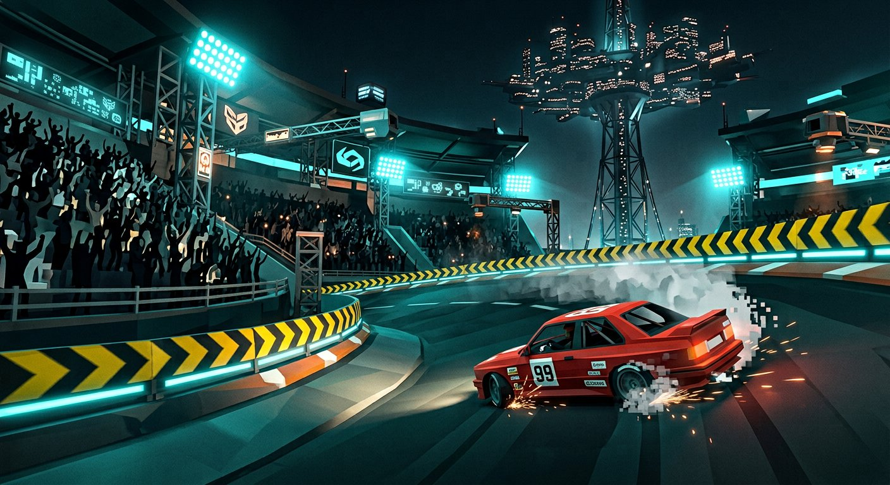

# MOTOR BALL GP — Iron City Circuit

A 3D browser racing toy that reimagines the **Motorball arena from Alita: Battle Angel**
as a proper **racecar circuit**. The film's rollerskating velodrome becomes a banked
"roval" — kept the hazard-striped bowl walls, the coliseum grandstands, the Factory
spire with **Zalem floating overhead**, and Iron City's skyline — but everything is
rebuilt for four wheels.

Built with **Three.js** (no build assets — every model, texture and sound is
procedural in code) and **Vite**.



## The track — 1.4 km banked roval

| Sector | Film inspiration | Racing translation |
| --- | --- | --- |
| Main straight + gantry | start/finish of the arena loop | pit lane, checkered gantry, start lights |
| **T1 "Bank of Zalem"** | the sweeping banked loops | 10° banked fast left sweeper |
| Infield esses | obstacle jinks in the arena | L–R–L technical section, off-camber flick |
| **Factory Turn** | the giant banked bowl under the tube | **18° superspeedway bowl**, flat-out |
| Hazard-striped walls | Alita's iconic yellow/black barriers | full-perimeter walls — scrape, never leave |
| Zalem spire | the tube connecting Zalem to Iron City | looms mid-infield with a floating city |

## The car — low-poly street sedan (#99 test mule)

A boxy 90s compact sedan modeled after a classic **Nissan Sentra** (~3.5k triangles):
side-profile extrusion shell, greenhouse glass band, V-grille, amber markers,
lip spoiler, 5-bolt steelies — wearing number **99** as a nod to Alita's Motorball
number. Five factory colors, press `C` to swap.

## Run it

```bash
npm install
npm run dev     # http://localhost:5173
```

Other scripts: `npm run build` (production bundle), `npm test` (headless smoke
test of track math/geometry).

## Controls

| Key | Action |
| --- | --- |
| `W` / `↑` | throttle |
| `S` / `↓` | brake / reverse |
| `A` `D` / `←` `→` | steering |
| `SPACE` | handbrake (drift) |
| `SHIFT` | nitro boost |
| `R` | reset car to track |
| `C` | change paint |
| `M` | mute / unmute |

## How it works

- **Track** — a closed Catmull-Rom spline sampled 768×; road, hazard kerbs and
  walls are ribbon geometries generated along it, with per-point **banking angles**
  interpolated around the loop. A spatial hash maps car position →
  (sample, lateral offset, surface height) every frame for physics, lap detection
  and the minimap.
- **Physics** — arcade velocity-catch-up model: steering follows a bicycle model
  capped by lateral-g (understeer at speed), velocity rotates toward the heading
  at a grip rate that collapses under the handbrake → controllable drifts.
  Banked corners physically tilt the car.
- **World** — procedural night scene: tiered grandstand bowl + 5,200-instance
  crowd, floodlight pylons with fake light cones, blinking Iron City skyline,
  sponsor boards (Zalem Motor Works, Panzer Kunst, Kansas Bar…), a live
  center-hung jumbotron showing your lap, and the Zalem platform overhead.
- **Audio** — WebAudio synth: detuned saws + square through a lowpass for the
  engine (fake 5-speed), band-passed noise for wind and tire scrub.
