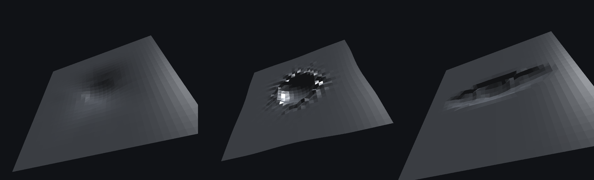

# Realtime fracture — glass, wood, rock, plastic, buildings

A live, interactive fracture sandbox in **TypeScript + WebGL2**, with no
dependencies beyond Vite. Shoot things and watch them break.

The point of the project: fragments are produced by **stress-driven crack
propagation under a Griffith energy budget** — not by Voronoi / cell fracture.
Read [`RESEARCH.md`](RESEARCH.md) for the survey, the physics and the reasoning.


```bash
npm install
npm run dev      # http://localhost:5173
```

## What's in it

| Target | Solver | What you should see |
|---|---|---|
| Window · annealed glass | shell crack network | Radial star from the impact, concentric arcs that terminate on the radials, wedge shards that fall only once fully surrounded — the rest hangs in the frame |
| Window · tempered glass | shell crack network | The stored tempering energy sweeps a branching front across the whole pane and dices it into 500+ pieces |
| Panel · acrylic (PMMA) | shell crack network | 50× the fracture energy of glass: a few wandering cracks, tough, arrests early |
| Boulder · granite | solid crack surfaces | Hertzian cone under the contact, meridional splitting, fragment size graded by distance from the impact |
| Beam · spruce | solid crack surfaces | Fracture energy across the fibres is ~10× along them, so it splits into long splinters |
| Panel · ABS plastic | solid crack surfaces | Gc ≈ 5000 J/m². Very few, very large pieces with stress-whitened torn edges |
| Panel · sheet steel | baked flat-sheet dent atlas | 1.2 mm steel skin. Three elasto-plastic bakes on a flat sheet — a dish, a crumpled crater and a long buckle — stamped at any point, any angle, any scale. A light hit dishes; a heavy one folds, because the structure around it gave way and fed the panel extra metal |
| Car · panel deformation | baked elasto-plastic shell + VAT | Steel yields, it does not fracture. The four structural crush zones replay a per-site offline plastic solve from a vertex-animation texture; every other hit stamps a portable flat-sheet dent at the exact contact point. Damage accumulates and never resets, paint crazes along the creases, and the headlight glass shatters live |
| Brick wall / concrete column | bonded structural graph | Load propagates down the mortar joints, overloaded joints snap, unsupported islands collapse and break up on landing |

## Controls

* **Left click** the object — fire (energy from the slider)
* **Drag** — orbit · **wheel** — zoom · **space** — fire at centre
* **← / →** — cycle targets · **R** — reset
* **Fracture time scale** — a pane shatters in ~0.5 ms in reality; the default
  1:1000 bullet-time lets you watch the crack tips run and the shards release
* **Debris time scale** — slow-mo for the rigid-body aftermath
* **Energy** — log scale, 1 J to 50 kJ, annotated with real-world equivalents
  (thrown stone, hammer, rifle round, car at 20 km/h)
* **Deformer** (car only) — A/B the exact per-vertex VAT against the lattice
  cage that drives every part bound to it

The solver readout on the left is live: crack paths, active tips, total crack
length, new surface area, the surface energy that bought it, and the terminal
crack speed (0.6 c_R) for the current material.

## Architecture





```
src/
  core/math.ts        vectors, quats, matrices, value noise, Weibull sampling
  geom/convex.ts      convex polyhedron kernel: plane clipping, mass properties,
                      mesh build with fresh-fracture-surface displacement
  sim/materials.ts    real SI material constants (E, nu, rho, Gc, sigma_t, m,
                      anisotropy, residual energy) + derived wave speeds
  sim/world.ts        rigid bodies, contacts, and the bonded Structure graph
                      (load propagation, joint failure, union-find islanding)
  frac/crack2d.ts     dynamic crack-tip network on a shell: Griffith arrest,
                      Mott speed law, micro-branching above 0.4 c_R, crack
                      shielding -> T-junctions, concentric ring nucleation,
                      tempered-glass dicing front
  frac/regions.ts     grid flood fill -> boundary walk -> RDP -> ear clip ->
                      extrusion; releases a piece only once it is fully cut free
  frac/solid.ts       3D crack surfaces chosen by a Griffith energy cascade,
                      Hertzian cone contact damage, orientation-dependent Gc
  frac/dentmap.ts     the portable bake: canonical dents solved on a flat steel
                      sheet in tangent space -> 1.1 MB displacement-map atlas
  app/dentfield.ts    live dent instances (type, frame, tangent frame, scale),
                      merge-on-repeat-hit, spring settle, shader packing
  frac/dent.ts        elasto-plastic shell solve (PBD + plastic creep) with
                      sphere and barrier contacts, baked to a sparse VAT, plus
                      the free-form deformation cage fit
  geom/carbody.ts     the test vehicle: ONE welded quad-gridded shell, plus
                      cage-bound lamps, wheels and surface-conformed glass
  app/carrig.ts       damage cursors per site, bake streaming, lamp breakage
  app/bakeWorker.ts   runs the plastic solve off the main thread
  render/vat.ts       vertex-animation textures, the portable dent atlas, and
                      the GLSL that plays both
  render/renderer.ts  forward renderer: shadow-mapped sun, analytic sky IBL,
                      procedural materials, separate sorted glass pass
  render/batch.ts     CPU-transformed debris batching (500 shards, 1 draw call)
  app/scenes.ts       the eight demo targets
  main.ts             camera, input, HUD
```

## Verifying it without a GPU

The solvers are pure TypeScript and run headless:

```bash
npx esbuild test/smoke.ts    --bundle --platform=node --format=esm --outfile=/tmp/s.mjs && node /tmp/s.mjs
npx esbuild test/preview.ts  --bundle --platform=node --format=esm --outfile=/tmp/p.mjs && node /tmp/p.mjs   # -> /tmp/cracks.png
npx esbuild test/preview3d.ts --bundle --platform=node --format=esm --outfile=/tmp/q.mjs && node /tmp/q.mjs  # -> /tmp/solid.png
npx esbuild test/preview_car.ts --bundle --platform=node --format=cjs --outfile=/tmp/c.cjs && node /tmp/c.cjs  # -> /tmp/car.png
npx esbuild test/preview_sheet.ts --bundle --platform=node --format=cjs --outfile=/tmp/d.cjs && node /tmp/d.cjs # -> /tmp/sheet.png
npx esbuild test/preview_app.ts  --bundle --platform=node --format=cjs --outfile=/tmp/a.cjs && node /tmp/a.cjs   # -> /tmp/app.png
npx esbuild test/frames.ts   --bundle --platform=node --format=cjs --outfile=/tmp/f.cjs && node /tmp/f.cjs      # every scene, every frame path
npx esbuild test/gpupath.ts  --bundle --platform=node --format=cjs --outfile=/tmp/g.cjs && node /tmp/g.cjs      # the GLSL, emulated against the real texture
npx esbuild test/shaders.ts --bundle --platform=node --format=esm --outfile=/tmp/h.mjs && node /tmp/h.mjs      # compiles every GLSL program
```

`smoke` prints material constants, fragment counts versus impact energy,
volume-conservation error and solver timings. `preview_car` reports patch
sizes, bake times, VAT footprint and the cage-vs-exact error. `preview_sheet`
bakes the portable dent atlas and evaluates the shader's stamping maths on the
CPU, on a flat sheet and on the car body.

Three of these exist because of a bug that none of the others could see.
`frames` drives the real per-frame path of every scene (build, pick, hit,
update, collect) and validates every render piece. `gpupath` builds the padded
RGBA32F texture exactly as `DentAtlasGpu` uploads it and runs a line-for-line
transliteration of the GLSL against it, so an indexing mistake fails a test
rather than showing a blank panel. And `preview_app` renders with the
**shader's own normals** instead of normals recomputed from the displaced
triangles — the difference is the difference between a dent you can see and
one you cannot, and every earlier preview in this repo was flattering the
result by using the latter. `shaders`
compiles every GLSL program with glslang, because a shader that fails to
compile takes the whole app down and there is no GPU in CI. The two `preview` scripts
rasterise the crack networks and the 3D fragments straight to PNG — the images
in this README were produced by them.

## License

MIT
