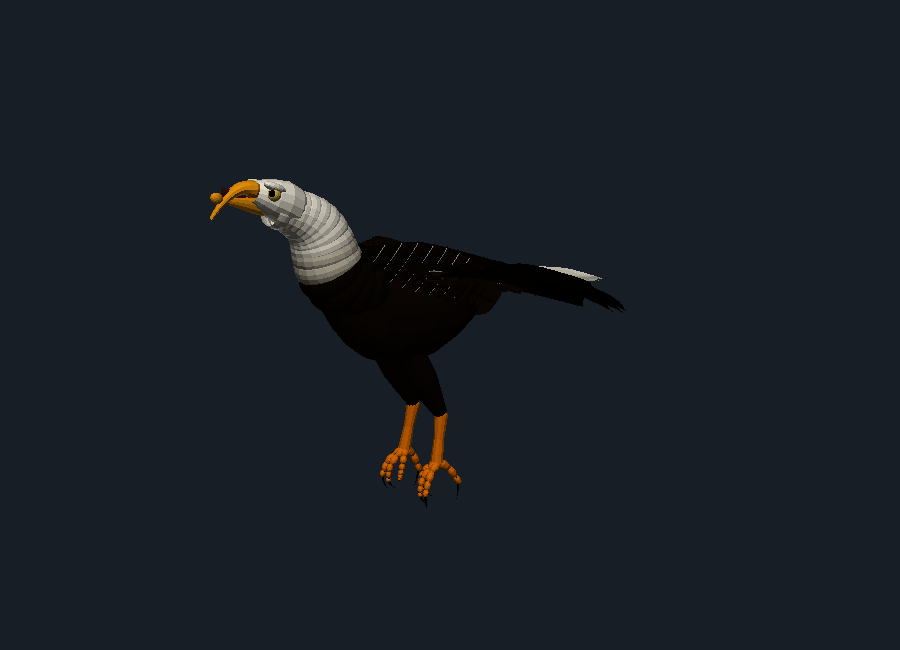
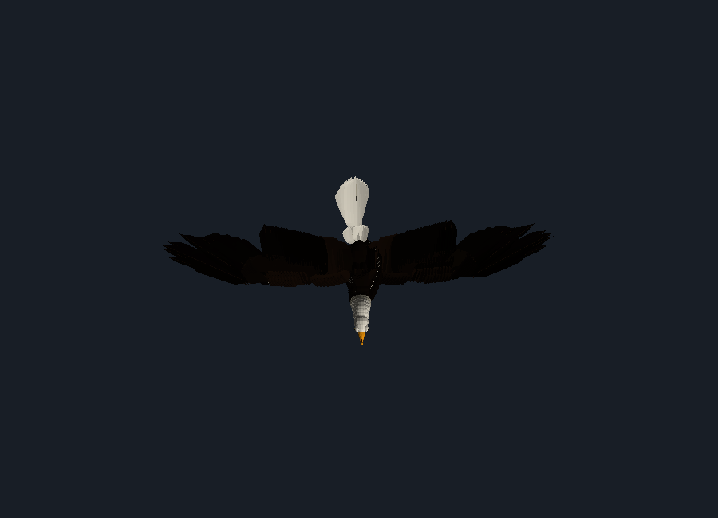

# Bald Eagle — anatomical 3D model & procedural animation

A real-time 3D bald eagle (*Haliaeetus leucocephalus*) built from measured
osteology. Everything is 3D geometry — there are no sprites, billboards or 2D
elements anywhere in the scene. The bird is modelled skeleton-first: a rig of
individually shaped bones at their published sizes, with the body, bare parts
and every feather tract parented to those bones, so all motion comes from the
skeleton deforming the bird.



## Run

```bash
python3 -m http.server 8080    # any static server
# open http://localhost:8080
```

No build step and no dependencies to install — `three@0.161` is pulled from a
CDN by the import map in `index.html`.

## Animations

| Cycle | What it does |
|---|---|
| **Wing flap** | 2.6 Hz wingbeat, 0.54 downstroke ratio, humeral elevation +42°/−48°, elbow and wrist flexed through the upstroke, humeral pronation leading the stroke by ~35° of phase, body heave/pitch reaction, neck-stabilised head, feather aeroelastic lag. |
| **Glide** | Wings at a small positive dihedral, wrist part-flexed, primary slots open, alula closed. Low-frequency thermal perturbation in roll/pitch/heave with asymmetric wing trim and a horizon-locked head. |
| **Walk** | 1.15 s stride, 0.72 duty factor, sprawled-femur avian gait (the visible joint is the ankle, not the knee), lateral waddle, twice-per-stride heave, thrust-and-hold head bob, toes curling clear on swing. |
| **Idle** | Perched: ~25 breaths/min, slow weight shifts between feet, discrete head saccades, periodic rousing (whole-body feather shake), tail twitches, grip adjustment. |
| **Screech** | Anticipation crouch → neck extension with a 38° gape and five call pulses → settle. Wings lift off the flanks, tail depresses, body lunges. |
| **Head turn** | 175° of yaw distributed across the 14 cervicals with counter-rotation anticipation, saccadic hold, the head roll raptors add off-axis, and a return. The body barely moves. |

Cycles cross-fade over 0.5 s. Playback speed, a skeleton x-ray toggle and a
plumage toggle are in the panel; keys `1`–`6` switch animation.

## Secondary animation

Nothing is keyframed on top — the secondary motion is derived from the primary
motion each frame:

* **Feather aeroelasticity** — primaries and secondaries bend up and twist
  nose-down in proportion to instantaneous wing load, with the bend lagging
  further outboard along the span.
* **Primary slotting** — the outer primaries separate on the upstroke and hold
  open in a glide, closed when the wing is furled.
* **Wing furling** — when the wing folds, each remex rotates about its own
  follicle so the tract stacks back along the body. The required rotation is
  solved numerically at start-up (`Animator.calibrateFold`) because the fold
  chain accumulates humeral twist.
* **Alula** — the leading-edge slat deploys with load and at low speed.
* **Tail** — the twelve rectrices fan, twist and tilt from the flight state.
* **Neck as a gimbal** — ~26° of counter-pitch spread over 14 cervicals removes
  about half of the body's vertical heave from the head in flapping flight
  (measured: 62 mm of body heave → 35 mm at the skull).
* **Ground contact** — while perched or walking the body height is *not*
  authored; the lowest talon is planted exactly on the ground each frame and
  the body rides on the limb kinematics.
* **Ruffle** — coverts and contour feathers carry band-limited noise scaled by
  the ruffle/rousing term.

## Anatomy

Long-bone lengths are the Royal BC Museum avian-osteology means for
*Haliaeetus leucocephalus*, cross-checked against the Trail (2017) bald-vs-golden
eagle tables:

| Bone | mm | Bone | mm |
|---|---|---|---|
| humerus | 205 | femur | 113 |
| ulna | 234 | tibiotarsus | 151 |
| radius | 221 | tarsometatarsus | 88 |
| carpometacarpus | 95 | coracoid | 80 |
| digit II ph1/ph2 | 46 / 23 | scapula | 112 |
| alular digit | 34 | sternum (keel) | 132 (48) |

Also modelled: 14 cervical vertebrae in the resting S-curve (the reason an eagle
can rotate its head past 180°), a 5-vertebra notarium, synsacrum and fused
pelvis, 5 free caudals plus the pygostyle, 7 rib pairs with sternal segments and
uncinate processes, the furcula/coracoid/scapula tripod with the triosseal
canal, quill knobs (*papillae remigales*) along the ulna and carpometacarpus,
the single occipital condyle, jugal bar, quadrate-hinged mandible, and the
raptor toe formula 2-3-4-5 with recurved talons and a reversed hallux.

Plumage follows the real topography: 10 primaries (outer six emarginated) on the
carpometacarpus and major digit, 17 secondaries on the ulna, 4 tertials,
scapulars, greater/median/lesser/marginal upper coverts, underwing coverts,
4 alula feathers and 12 rectrices — with adult colouring (white head and tail,
blackish-brown body, yellow cere, bill and tarsi, pale iris).



## Layout

```
index.html          viewer shell + UI
src/bonegeo.js      swept-tube bone geometry helpers
src/skeleton.js     the measured skeleton and joint hierarchy
src/plumage.js      feather geometry, feather tracts, body/head/leg shells
src/animation.js    pose engine, the six cycles, secondary-motion driver
src/main.js         scene, lighting, ground, camera, UI wiring
```

Axes: **+X** right, **+Y** up, **+Z** cranial. Limbs are authored on the +X side
and the left side is instantiated inside a `scale.x = -1` group, so identical
local joint angles give true bilateral mirroring — flexion about X is preserved
while ab/adduction about Y/Z mirrors.

## References

* Royal BC Museum, *Avian Osteology* — bald eagle skeletal element measurements.
  <https://rbcm.ca/Natural_History/Bones/Species-Pages/BAEA.htm>
* Trail, P. W. (2017) *Identifying Bald versus Golden Eagle Bones*, Journal of
  Raptor Research — long-bone length tables.
* Bone Clones, articulated bald eagle skeleton (posture/proportion reference).
* de Margerie et al. (2006); Lubarda et al. (2017), *J. Mech. Behav. Biomed.
  Mater.* — avian wing-bone morphology and cross-sections.
* Avian skeletal system overviews (pectoral girdle tripod, triosseal canal,
  uncinate processes, carpometacarpus and digit identity).
* Flapping-flight kinematics: wingbeat frequency, downstroke ratio, stroke
  amplitude and pitch-phase relationships from avian flapping-flight literature.
