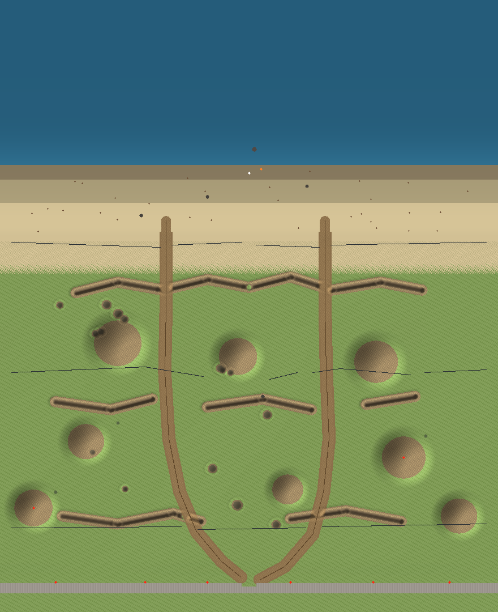

# Slate — STEEL TIDE

A low-poly **D-Day beach assault** built with Three.js. You land on the beach
between a **rising ocean tide** and **the Wall** — and you have to reach it.



## The battlefield (ocean → wall)

- **Rising tide** — the ocean level climbs for ~7 minutes and floods the beach,
  the wire belts and finally the first trenches. Wading slows you, deep water drowns you,
  a flooded engine dies.
- **Beach** — Czech hedgehogs, wrecked tanks, a burnt landing craft, three lanes.
- **Barbed wire belts** with gaps (barriers channelize you, AP mines wait in the centre gap).
  On foot they cut you up; **the car smashes through them**.
- **Fire trenches** (zig-zag, duckboards, plank bridges where roads cross) — step in and the
  sentries lose line of sight on you.
- **Minefield** — ~60 tank mines (pressure plates: only vehicles trigger them, but the blast
  kills anyone nearby) plus ~40 anti-personnel mines that blink and explode.
- **Huge mounds of earth** — cover from sentry fire; two carry forward bunkers.
- **Dirt roads** from the beach gaps to the gate — fast, mined, and covered.
- **Dragon teeth** row + wire + a Jersey-barrier chicane before the wall.
- **The Great Wall** — 16 m of concrete with six bunker sentries that
  **track and shoot vehicles** with twin autocannons. Reach it (z ≈ 162) to win.

## The car

A low-poly sedan (Nissan-Sentra-ish silhouette, extruded side profile — not a box).
`E` to enter/exit. Arcade physics: terrain following, obstacle collisions, engine flooding,
damage states (smoke → fire → explosion). Sentries prioritize it over you — use it wisely.

## Controls

| Key | Action |
| --- | --- |
| `WASD` | Move / drive |
| `SHIFT` | Sprint |
| `SPACE` | Jump / handbrake |
| `E` | Enter / exit vehicle |
| `C` | Toggle orbit camera |
| `M` | Mute |
| `ESC` | Pause |

## Run

Any static file server, e.g.:

```bash
python3 -m http.server 8000
# open http://localhost:8000
```

No build step, no assets — everything (geometry, textures, sound) is generated procedurally.

## Dev

```bash
node test/smoke.mjs    # headless logic test: builds the world, simulates gameplay
node test/boot.mjs     # full E2E: boots the real main.js in a fake DOM + fake GL,
                       #   plays through every path (81 asserts)
node test/mapview.mjs  # renders test/map.png (top-down battlefield map)
node test/asciimap.mjs # ASCII overview of the layout
```

Structure: `js/world.js` (terrain heightfield, tide, sky) · `js/props.js` (wall, bunkers,
sentries, tanks, wire, mines, sandbags) · `js/car.js` · `js/player.js` · `js/combat.js`
(sentry AI, mines, wire, tide) · `js/effects.js` · `js/audio.js` (synthesized) · `js/main.js`.
