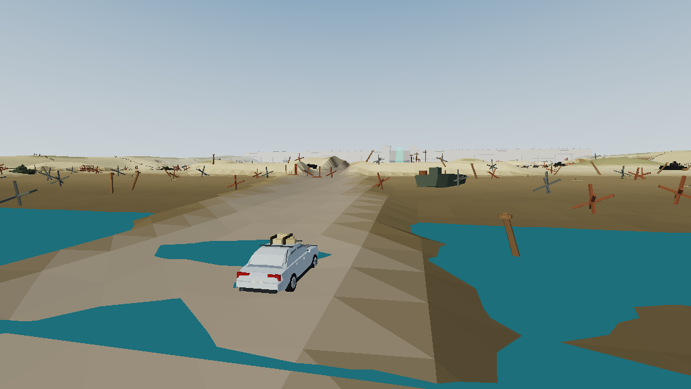
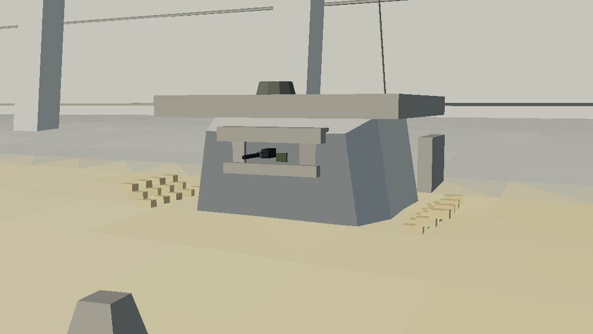

# Operation Slate

A low-poly D-Day beach assault, played from behind the wheel of a civilian saloon.

You are dropped in the surf at the far end of a 600-metre invasion beach. Ahead of you: four
belts of hedgehogs and log ramps, a minefield, wire, trenches, wrecked armour, dragon's teeth
and a twenty-eight-metre concrete wall lined with machine-gun bunkers and anti-tank guns.
Behind you: the tide. It never stops coming in.

Reach the breach in the wall before the beach kills you or the Channel does.


## Run it

```bash
npm install
npm run dev        # http://localhost:5173
```

```bash
npm run build      # production bundle into dist/
npm test           # headless integration self-test (no browser needed)
npm run sim        # headless difficulty probe, drives a bot up the causeway
npm run shots      # offscreen renders of every camera view into screenshots/
```

Only runtime dependency is [three.js](https://threejs.org/). No assets are loaded from disk —
every mesh, texture and sound in the game is generated procedurally at boot.

## Controls

| Key | Action |
| --- | --- |
| `W` / `↑` | Throttle |
| `S` / `↓` | Brake, then reverse |
| `A` `D` / `←` `→` | Steer |
| `Space` | Handbrake |
| `C` | Cycle camera (chase / bonnet / wide) |
| `R` (hold) | Recovery — lifts you onto the nearest track for −5% integrity |
| `P` | Pause |
| `M` | Mute |
| `Enter` | Start / retry |

## The beach



- **The wall** — 514 m of concrete, 23.5 m tall, with gate towers, a raised blast door and
  a barbed-wire crown. The only way through is the breach at `x = 0`, marked by a green beam.
- **Sentries** — 13 crewed emplacements. Nine pillboxes on the apron and four nests on the wall
  top, a mix of MG posts and anti-tank guns. They need about a second to lock on, they lose you
  behind wrecked armour, earth mounds and sandbag walls, only two may open up at once, and each
  burst carries its own aim error — so changing speed and using cover genuinely works.


- **Mines** — anti-personnel scatter mines (small damage) and Teller anti-tank plates (they
  will end a run). Both are visible on the sand and the HUD pings as you close on one. Roads
  are swept, so they are the clean line — and the exposed one.
- **Barricades** — Czech hedgehogs and log ramps in the tidal belts, Belgian gates and
  sandbag emplacements chicaning the roads, and three rows of dragon's teeth across the apron.
- **Cover** — ten abandoned tanks, seventeen earth mounds, eight trench systems, sandbag
  parapets, bomb craters. All of it blocks line of sight; none of it blocks the tide.
- **The tide** — rises 6 m over 175 seconds with a surge on top. Water robs you of grip and
  power, and past knee height the engine starts drowning. The start line is under two metres
  of water by the time the tide is full.
- **Repair crates** — six of them, +28% integrity, usually somewhere unwise.

## Code layout

| File | What lives there |
| --- | --- |
| `src/terrain.js` | Heightfield, beach profile, roads, trenches, mounds, craters, headlands, per-vertex surface colouring, surface types and the height texture the ocean samples |
| `src/water.js` | Tide simulation and the ocean shader (Gerstner-ish wave sum, depth-based colour, shoreline foam) |
| `src/car.js` | The saloon: a hand-lofted low-poly body (not a box), wheels, suspension, and an arcade-but-grippy vehicle model with surface-dependent traction |
| `src/physics.js` | Broad-phase collider grid, car-vs-world resolution, wire drag, line-of-sight occluders |
| `src/wall.js` | The wall, gate towers, blast door, buttresses, wire crown and the gun mount contract |
| `src/defense.js` | Sentry AI (scan → lock → burst → cool), bullets, AT shells, engagement budget |
| `src/mines.js`, `src/obstacles.js`, `src/tanks.js` | Instanced clutter: mines, hedgehogs, gates, wire, crates, tank wrecks |
| `src/fx.js` | Particle pools, tracers, shockwave rings, scorch decals, screen shake |
| `src/audio.js` | Procedural WebAudio engine, gunfire, explosions, surf |
| `src/hud.js`, `index.html` | HUD, minimap, briefing and after-action screens |
| `src/game.js` | Wiring, camera modes, win/lose flow, restart |

## Headless tooling

There is no browser in the development sandbox, so the repo carries its own offscreen
renderer: `scripts/lib/raster.mjs` is a small software rasteriser that walks a real
`THREE.Scene` — including instanced meshes and per-vertex colours — and writes a PNG.
`scripts/render.mjs` builds the actual game world with it and shoots a fixed set of camera
angles, which is how the beach was art-directed.

`scripts/selftest.mjs` builds the same world, drives it with the shared autopilot in
`scripts/lib/autopilot.mjs`, and asserts the things that are easy to break: the wall never
hangs over water, roads stay free of mines, the beach stays drivable, the car never goes NaN,
and a restart genuinely re-arms the minefield.
