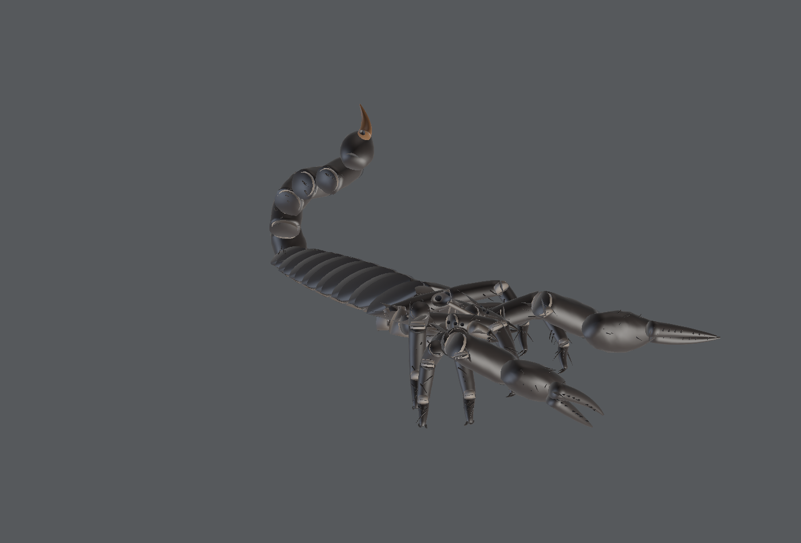
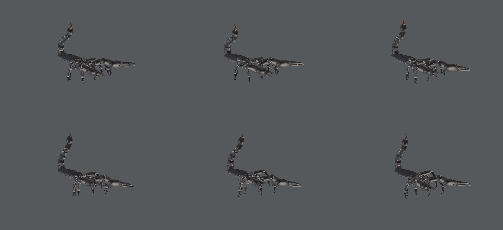
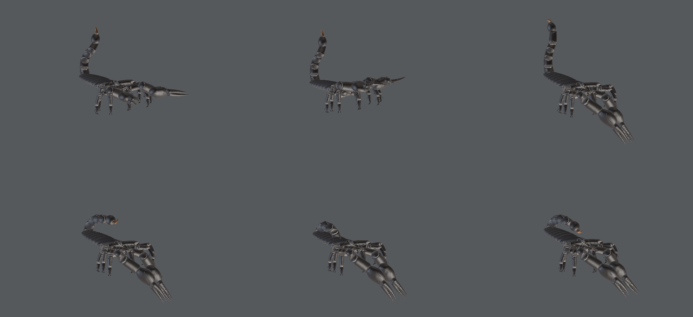
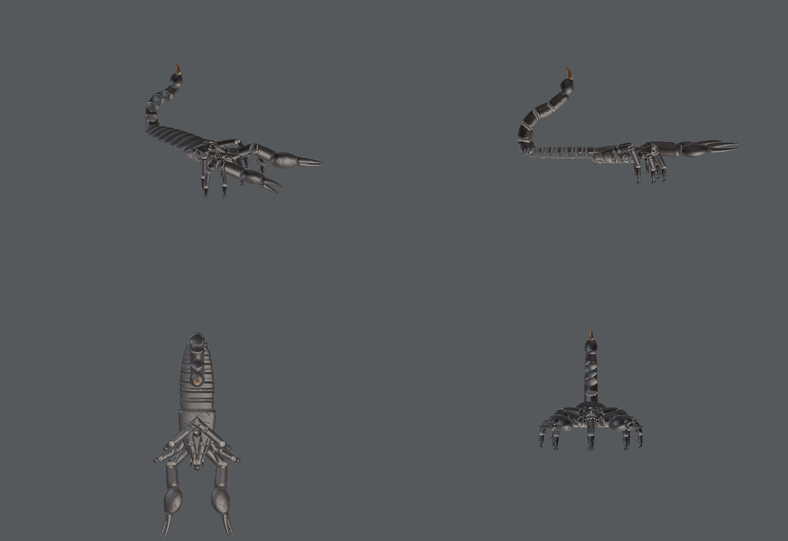

# Scorpion — procedural 3-D model, rig and animation set

A fully procedural, anatomically-structured scorpion (*Pandinus imperator*,
the emperor scorpion) generated from source, exported as a rigged, animated
**glTF 2.0 binary** (`build/scorpion.glb`), plus a WebGL viewer.



Everything here is generated by code in `src/` — no downloaded assets, no
placeholder geometry. The build has **no third-party dependencies**: it runs
on a stock Python 3 interpreter.

```bash
python3 src/scorpion.py     # -> build/scorpion.glb
python3 src/sheets.py       # -> docs/*.png contact sheets
python3 -m http.server 8080 # then open /viewer/index.html
```

## What is in the model

| | |
|---|---|
| Format | glTF 2.0 binary (`.glb`), self-contained |
| Geometry | ~30 k triangles, ~16 k vertices, smooth-shaded, 6 PBR materials |
| Rig | 65 nodes / 62 articulated joints, rigid-segment (exoskeletal) hierarchy |
| Animations | `Idle`, `Walk`, `Run`, `Attack`, `Sting` — 30 fps baked |
| Scale | real-world metres; 190 mm body length, 42 mm carapace |

### Anatomy

Built to the standard scorpion body plan (Polis, *The Biology of
Scorpions*), cross-checked against the photographic references in
`reference/`:

- **Prosoma** — broad, flat-bottomed, granulated carapace with a raised
  ocular tubercle carrying the two **median ocelli**, plus **three pairs of
  lateral ocelli** on the antero-lateral margin, anterior median furrow, and
  a ventral sternum.
- **Chelicerae** — a pair of small two-fingered jaws at the front.
- **Pedipalps** ×2 — coxa → femur → patella → **chela**. The chela is a
  bulbous, laterally swollen manus with an immovable finger, an articulated
  movable finger, **dentate cutting margins** and **trichobothria** (the
  sensory hairs scorpions hunt by).
- **Legs** ×8 — coxa + trochanter → femur → patella → tibia → tarsus, each
  ending in **paired ungues** (tarsal claws) and carrying setae. Segment
  lengths increase from leg I to leg IV (leg IV spans ~50 mm).
- **Pectines** ×2 — the comb organs unique to scorpions, 16 teeth each,
  mounted ventrally behind the leg coxae, and animated to sweep the
  substrate while walking.
- **Mesosoma** — 7 overlapping tergites with posterior lips, paler
  sternites, and 4 pairs of **book-lung spiracles**.
- **Metasoma** — 5 keeled, granulated segments with arthrodial membrane
  collars between them and ventral setae.
- **Telson** — the vesicle (venom bulb) with subaculear tubercle, and the
  recurved, amber-tipped **aculeus** (the sting) as its own joint.

### Rig

Arthropods have a rigid exoskeleton, so the rig is a rigid-segment node
hierarchy rather than a smooth-skinned mesh — each cuticular sclerite is its
own mesh on its own joint, exactly as the animal is built. This is
anatomically correct and imports cleanly into Blender, Unity, Unreal,
three.js, Godot, model-viewer, etc.

```
scorpion_root
└ body
  └ prosoma
    ├ chelicera_L/R
    ├ pedipalp_coxa_L/R → femur → patella → chela → finger_movable
    ├ leg_{L,R}{1..4}_coxa → femur → patella → tibia → tarsus
    ├ pecten_L/R
    └ mesosoma → metasoma_1..5 → telson_vesicle → aculeus
```

Leg poses are not hand-keyed: `leg_ik()` in `src/scorpion.py` is an analytic
4-link solver (yaw + planar femur/patella two-bone IK with a fixed distal
tibia/tarsus attitude, knee-up), so every foot is placed at a world-space
target and then baked to joint rotations. The standing pose is baked into
the bind transforms, so the model looks correct with no clip playing.

## Animations



**`Walk` (1.05 s loop) / `Run` (0.62 s loop)** — the arachnid **alternating
tetrapod** gait: legs I and III of one side step in phase with legs II and
IV of the other, the two tetrapods in antiphase, duty factor 0.62
(Bowerman 1975; Root & Bowerman 1978). Each foot is IK-planted: during
stance the target is dragged backwards at exactly the stride rate and during
swing it lifts on a sine arc and reaches forward — so there is **no foot
slip** when the clip is driven at the matching ground speed
(2 × stride ÷ cycle = 38 mm/s walking, 90 mm/s running; the viewer uses
exactly that). The body bobs twice per cycle, rolls and yaws with the
tetrapods, the tail counter-sways, and the pectines sweep.



**`Attack` (1.90 s)** — a full predatory sequence in the real order:
crouch and cock the metasoma → lunge forward with the pedipalps thrust out
and the chelae gaping → **chelae snap shut on the prey** (~120 ms) → the
metasoma whips up and over the carapace and the aculeus **jabs
forward-and-down** into what the claws are holding (the sting arrives
150–250 ms after the grab, as in high-speed footage of scorpionid strikes)
→ brief envenomation hold with the claws trembling → withdraw to rest.
The front legs lift and the rear legs brace during the lunge.

**`Sting` (1.10 s)** — the telson strike alone, for layering over other
states. **`Idle` (3.0 s)** — breathing, tail sway, pedipalp micro-motion.



## Viewer

`viewer/index.html` — three.js r160, PBR + soft shadows + environment
lighting, clip switcher with cross-fades, speed slider, orthographic-style
view presets, turntable, wireframe toggle, and locomotion that advances the
model at the gait's true ground speed.

## Layout

```
src/scorpion.py   anatomy, rig, IK and animation authoring  (the build)
src/geom.py       swept tubes, ellipsoids, spines, tapers, granulation
src/mathutil.py   vector / quaternion / easing helpers
src/gltf.py       minimal glTF 2.0 + GLB writer
src/render.py     GLB reader + software rasteriser (headless verification)
src/sheets.py     documentation contact sheets
viewer/           WebGL viewer
reference/        photographic and anatomical references used
build/            generated scorpion.glb
docs/             generated renders
```

The renders in `docs/` were produced by `src/render.py`, a dependency-free
z-buffered rasteriser with three-point lighting — it reads the exported GLB
back, so the images are proof the file parses and animates correctly.
