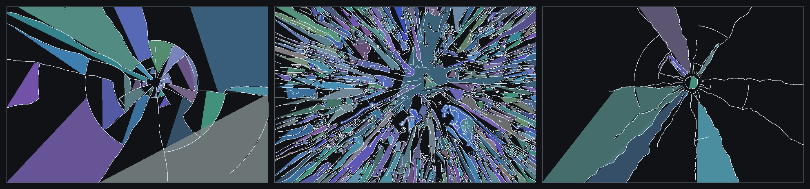
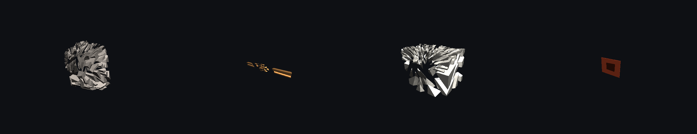
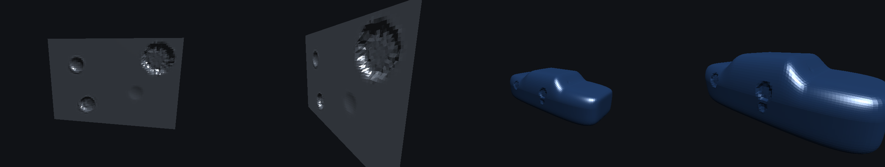
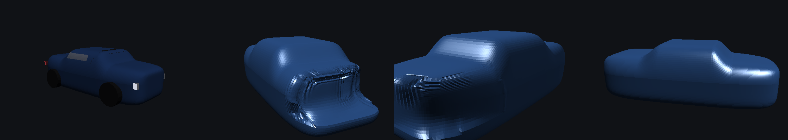

# Realtime fracture for games — research notes and design rationale

Target: glass, wood, buildings, plastics and rock, breaking believably, at frame
rate, in a AAA context. Explicit constraint from the brief: **do not use the
usual cell-fracture / Voronoi shatter**.

This document is the research pass. The implementation that follows from it
lives in `src/` and runs in the browser (WebGL2 + TypeScript).

---

## 1. Why Voronoi / cell fracture is the wrong tool

Voronoi pre-fracture (Blender's Cell Fracture, Houdini's `voronoifracture`,
Unity shatter assets) scatters seed points inside a mesh and assigns every
point of the volume to its nearest seed. It is fast, robust and completely
disconnected from any physics. The consequences are visible in every frame:

| Artefact | Cause |
|---|---|
| Every fragment is **convex** | A Voronoi cell is an intersection of half-spaces, by construction. Real fragments are routinely non-convex: spall flakes, splinters, L-shaped wall chunks. |
| Cracks **cross** instead of terminating | Real crack tips arrest when they reach the unloaded wake of an existing crack, producing **T-junctions**. Voronoi cell boundaries meet at Y-vertices of three cells. This one detail is the strongest visual tell. |
| Fragment size is **uniform and isotropic** | Real fragmentation is graded: pulverised at the contact, coarse at distance (Grady–Kipp / Rosin–Rammler statistics). |
| Structural weaknesses are **ignored** | A femur breaks mid-shaft; a plank splits along the grain; a brick wall fails at the mortar. Seed points know none of this. The "Breaking Good" paper makes exactly this criticism and demonstrates the failure cases ([Sellán et al., SIGGRAPH 2022](https://dl.acm.org/doi/full/10.1145/3549540)). |
| Impact **direction and energy don't matter** | The same pattern appears whether you tapped it or shot it. |

Pre-fracture with artist patterns (Rainbow Six Siege style) fixes plausibility
by hand but costs authoring time and repeats visibly.

So: keep the *runtime budget* discipline of pre-fracture, throw away the
*geometry generator*, and replace it with something driven by stress.

## 2. What shipping games actually do

| Game / tech | Approach | Notes |
|---|---|---|
| Red Faction: Guerrilla (GeoMod 2) | Pre-chunked buildings + **realtime stress propagation** through a connectivity graph | Load is pushed through the structure; overloaded joints snap; disconnected islands go dynamic. Progressive collapse is the headline feature. |
| The Finals, Teardown | Same family: voxel/chunk graph + structural analysis | [GMTK's survey](https://gmtk.substack.com/p/how-games-do-destruction) notes The Finals' system is "basically identical to Red Faction". |
| Star Wars: The Force Unleashed (DMM) | **Corotational tetrahedral FEM**, deform-then-fracture | Parker & O'Brien. Beautiful for wood/metal bending before failure; expensive. |
| Rainbow Six Siege | Authored **cut patterns** boolean'd into walls at runtime | Cheap, art-directed, per-weapon patterns. |
| Red Faction 1 | Realtime **BSP booleans** (Naylor merge) | Arbitrary holes, but level design has to survive anything. |
| NVIDIA Blast / APEX | Pre-fracture (Voronoi/VACD) + bond graph + runtime damage | The industry default, and the thing this project deliberately avoids for geometry. |
| Bullet `FractureDemo` | Composite rigid body with breakable bonds + union-find islanding | Erwin Coumans' [overview of destruction techniques](https://www.gamedeveloper.com/programming/opinion-destruction) is still the best short survey. |
| Breaking Good (2022) | Precomputed **fracture modes** — a sparsified eigenproblem giving a shape's natural ways of breaking; impacts are projected onto the modal basis at runtime | Drop-in replacement for Voronoi prefracture at *zero* runtime cost. The key insight I borrow: do the expensive physics offline, keep a cheap runtime projection. |

Research-grade alternatives that are still too slow for a frame budget, but
which define what "correct" looks like: XFEM, cohesive-zone FEM, **peridynamics**
(handles branching naturally), phase-field fracture, boundary-element methods
with explicit Lagrangian crack fronts, and MPM for granular debris.

## 3. The physics I actually implement

### 3.1 Griffith energy balance — the master rule

A crack advances only if the elastic energy it releases pays for the surface it
creates:

```
G ≥ Gc          G = release rate [J/m²],  Gc = fracture energy [J/m²]
σ_c = √(E·Gc / π a)                       (critical stress for a flaw of size a)
```

Everything in this project is budgeted with this one equation. An impact
deposits energy `E`; a fraction becomes new surface; that fraction divided by
`Gc` is a hard budget of *square metres of crack*. It is why:

* glass (Gc ≈ 8 J/m²) shatters into dozens of pieces from a few joules,
* ABS plastic (Gc ≈ 5000 J/m²) barely cracks from the same energy — it buys
  600× less surface,
* tempered glass dices: thermal tempering stores ~2×10⁴ J/m³ of residual strain
  energy, hundreds of joules in a window pane, enough to pay for hundreds of
  metres of crack with no help from the impact at all.

### 3.2 Dynamic crack speed and micro-branching

* Limiting speed is the Rayleigh wave speed `c_R` (soda-lime glass ≈ 3100 m/s).
* Real cracks saturate around **0.5–0.6 c_R**; Doll measured ~1500 m/s in plate
  glass ([Sundaram & Tippur, JMPS 2018](https://www.eng.auburn.edu/~htippur/papers/Sundaram-Tippur-JMPS-2018.pdf)).
* Above **~0.4 c_R** a single tip can no longer radiate the incoming energy
  flux and undergoes the **micro-branching instability** — it sheds side
  branches ([Fineberg, Sharon et al.](https://www.osti.gov/pages/servlets/purl/1906135)).
* Branch half-angles are ~12–30°, and branching needs `G` well above `Gc`.

Implemented in `src/frac/crack2d.ts` as: speed from a Mott-style
`v = v_term (1 − Gc/G)`, branching as a *rate per metre* that switches on above
`0.4 c_R`.

### 3.3 Weibull flaw statistics

Brittle strength is set by the worst flaw in the stressed volume, so strength is
Weibull-distributed (glass m ≈ 5, rock m ≈ 9, tempered glass m ≈ 12) and bigger
pieces are weaker than small ones. This gives, for free: scatter between
repeated impacts, and the observed *size effect* where large blocks split first.

### 3.4 Glass, specifically

Forensic fractography is unusually well documented, which makes glass the
easiest material to get *right* and the most obviously wrong when it isn't
([SWGMAT glass fractures](https://www.asteetrace.org/static/images/pdf/02%20Glass%20Fractures.pdf)):

1. The pane bends. The **back face** goes into radial tension first, so
   **radial cracks** nucleate there and run outward. Their count scales roughly
   linearly with the energy dissipated in cracking.
2. The triangular **petals** between radials keep bending until they snap
   across — producing **concentric arcs that terminate on the radials**
   (never crossing them). Concentric cracks originate on the *impact* face.
3. A hard, blunt or high-velocity contact punches a **Hertzian cone**: a ring
   crack just outside the contact circle flaring into a cone through the
   thickness (~22° half angle in glass). Exit hole > entry hole.
4. Fracture surfaces show **mirror → mist → hackle** bands and **Wallner
   lines**; hackle scatters light, which is why broken glass edges glitter.
5. **Tempered glass** is a different animal: the impact only has to breach the
   compressive skin, after which the stored energy drives a self-sustaining
   branching front across the pane at ~1500 m/s and dices it into ~cm cubes.
   Annealed glass gives long "sword" shards; tempered gives dice.

### 3.5 Wood, rock, concrete

* **Wood** is orthotropic. Mode-I fracture energy along the grain (RL/TL) is
  ~250–550 J/m², while breaking *across* fibres costs roughly an order of
  magnitude more ([Frühmann et al.](https://www.researchgate.net/publication/248470254)).
  Make `Gc` a function of crack-plane orientation and long splinters fall out
  of the solver by themselves.
* **Rock/concrete**: contact comminution, a Hertzian/percussion cone, radial
  meridional splitting from hoop tension, and **back-face spall** where the
  compressive pulse reflects off the free surface as tension. Fragment sizes
  grade with distance from the impact.
* **Masonry** fails at the joints long before the units do: mortar tensile
  strength is ~0.3 MPa against ~2 MPa for brick, which is why the structural
  graph, not the block solver, decides how a wall comes down.

---

## 4. The design that came out of this

Three solvers, one shared energy budget, no Voronoi anywhere.

### A. Shell solver — live crack-tip propagation (`frac/crack2d.ts`)

For panes and panels. A population of crack **tips** is integrated through the
plate's stress field. Each tip has a position, direction, speed and energy
release rate. Per step it:

* reads the local stress (hoop stress for radial cracks, radial bending stress
  for concentric ones) from an analytic impact field,
* takes a Griffith decision: propagate, or arrest,
* steers toward the maximum-tension direction, wanders through a Weibull flaw
  field, and is **repelled by neighbouring cracks** (stress shielding) — which
  is what produces T-junctions rather than crossings,
* micro-branches above 0.4 c_R,
* rasterises itself into an occupancy grid.

Fragments are then extracted *incrementally* from that grid: flood fill →
connected components → directed-edge boundary walk → Douglas–Peucker → ear
clipping → extrusion through the thickness. A component becomes a rigid body
**only when it is completely surrounded by cracks**. Pieces still touching the
frame stay in the window, hanging, exactly like a real broken pane.



*Left: annealed float glass, 40 J — radial star, concentric arcs terminating on
radials, wedge shards reaching the frame. Middle: tempered glass, same impact —
the stored energy dices it into 500+ pieces. Right: 4 mm acrylic at 400 J —
50× the fracture energy, so a handful of wandering cracks and 12 pieces.
All three are the same solver with different material constants.*

### B. Solid solver — energy-cascaded crack surfaces (`frac/solid.ts`)

For rock, wood, concrete blocks, thick plastic. The body is a convex cell that
gets carved by crack **surfaces**, chosen one at a time:

1. Distribute the impact energy through the body (concentrated at the contact).
2. For the cell with the best drive/cost ratio, sample its weakest Weibull flaw,
   generate candidate crack planes (hoop-tension meridional, back-face spall,
   grain-aligned), and score each by
   `energy × resolved tension / (Gc(n) × area)`.
3. Split on the winner, charge the **actual** new surface area to the cell's
   energy, and hand what is left to the two children by volume.
4. Stop when nothing can pay.

Plus an explicit **Hertzian cone** cut for hard brittle contacts, approximated
by a fan of tangent planes so each piece stays convex for collision.

Because the cost term is orientation dependent, wood splinters along the grain
with no special-case code, and because the energy is graded from the contact,
fragment sizes grade too. Fragment count scales with energy the way it should:
granite gives 8 pieces at 120 J, 54 at 1.5 kJ, 150+ at 12 kJ.



*Granite boulder, spruce beam (long grain-parallel splinters), concrete block,
ABS panel (too tough to break at that energy). Bright faces are fresh fracture
surface. Volume is conserved to floating-point exactly.*

---

## 4b. Metal: plastic deformation, baked and replayed (the car case)

Fracture is the wrong model for a car panel. Sheet steel does not create new
surface, it *yields*: the crystal lattice slips, the shape changes permanently,
and nothing separates. Modelling that with a crack solver produces nonsense.
It needs its own pipeline.

### What sheet steel actually does

| Quantity | Mild steel body panel | Consequence |
|---|---|---|
| Yield strain `sigma_y/E` | 250 MPa / 200 GPa = **0.00125** | It takes almost no strain to leave a permanent mark. |
| Elastic springback | recovers ~`sigma_y/E` of strain on release | A dent is always shallower after the impactor leaves than while it is in contact. |
| Membrane vs bending stiffness | bending is ~2 orders softer for 0.8 mm sheet | The panel **folds** rather than stretching: dents have creases and sharp rims, not smooth bowls. |
| Work hardening | flow stress rises with accumulated strain | Successive hits in the same place do progressively less. |
| Paint | clearcoat crazes at a few % strain, basecoat flakes | Bare metal and primer show along the crease, which is most of the visual read. |

Front and rear impacts are not "denting" at all: the crush zone **shortens**,
converting kinetic energy into folded metal. So the demo models two contact
types — a sphere (pole, bollard, another car's corner) and a barrier (flat
obstacle / another car's bumper bar), which prescribes a longitudinal
compaction field and lets the shell relaxation buckle the excess sheet.

### Why bake it

The solver is position-based dynamics with plastic constraint creep
(Müller et al. 2007) — the standard stable formulation for large plastic
deformation:

```
stretch  |xi - xj| = L0            stiff   (membrane)
bend     |xa - xb| = B0            soft    (fold instead of stretch)
plastic  if |eps| > epsY:  L0 += sign(eps)(|eps| - epsY) L0 k
```

One dent is ~36 000 constraint projections per iteration, 24 iterations per
crush step, 14 crush steps, plus a release pass at each step so the panel
springs back onto its new plastic rest shape. That is 0.5-1.7 s per site in
this demo — three orders of magnitude outside a frame budget, and it always
produces the *same* answer for the same site. Textbook precompute.

### The bake: a damage axis, not a time axis

For each site the bake presses the impactor in by `1/F` of full depth, relaxes,
lets plastic strain accumulate, then **removes the impactor and relaxes again**
so the panel springs back. That released state is frame 1. Press deeper, repeat
— frame 2, 3 ... F. The sequence is monotone, so the "time" axis of the
animation is really **accumulated damage**:

* impact energy decides how far along the sequence to play (9 kJ ≈ 1.4 t at
  13 km/h = full depth),
* repeat hits keep advancing the same cursor and it never resets,
* a critically damped spring drives the visible cursor to the target, so the
  panel booms in and settles instead of snapping.

Per vertex, per frame, the bake stores displacement (xyz) and accumulated
plastic strain (w, which drives the paint damage), plus the recomputed normal.

### Playback: vertex animation texture, sparsely packed

At runtime the vertex shader does the whole thing (`render/vat.ts`):

```
pos += SUM_k  amp_k * texelFetch(uVatPos, base[site_k] + frame*P + slot)
```

with the frame cursor interpolated between two baked frames, up to 6 dents
blended at once. There is no runtime solve at all — the cost is a handful of
texture fetches per vertex, the body stays **one draw call**, and it is trivial
to LOD (stop blending distant dents) or to instance across a hundred cars.

The one non-obvious trick: a dent only moves a few percent of the body, so
storing a full-body VAT per site is 90 % zeros. Each bake is pruned to the
vertices that actually moved (> 0.3 mm) and a per-site **slot table** maps mesh
vertex → patch slot, with 0 meaning "this vertex is not in this dent". For this
body that is the difference between 60 MB and **5.7 MB** for all 12 sites.

### The lattice cage

The per-vertex VAT is exact but married to one mesh. Production rigs usually
bake into a **deformation lattice** (free-form cage) instead, and this demo
does both so they can be A/B'd live:

| | per-vertex VAT | lattice cage (22×9×9 FFD) |
|---|---|---|
| Accuracy | exact | mean 0.09 mm, max ~28 mm error (creases round off) |
| Bound to | this exact mesh | anything inside the cage |
| Drives lights / glass / badges / LODs | no, each needs its own bake | yes, automatically |
| Cost | 1 fetch per dent | 8 fetches per dent (trilinear) |

In the demo the body uses the per-vertex path by default, while the headlamp
lenses and the window glass are **always** cage-driven — one bake, and every
part glued to that panel moves with it. That is the argument for the cage in a
real pipeline: you bake the panel once and every trim variant, LOD and decal
mesh inherits the damage for free.

### Portable dents: bake one steel sheet, stamp it anywhere

The per-site bake above answers "what does *this car* do when hit *there*".
It is exact, but it is also 12 fixed answers, and a new vehicle means a new
cook. The generalisation is to notice **what a dent actually depends on**.

Away from a structural member, a panel dent is a *local* event. The steel is a
thin shell under membrane tension with a plastic hinge ring; the physics is
translation- and rotation-invariant along the surface, and over the ~30 cm
footprint of the dent the panel's own curvature is a second-order correction.
That is exactly the argument behind stamped/decal deformation in shipping
racing games, and behind "detail maps" for damage in general: the interesting
information is in the *shape of the dent*, not in where it happened.

So the bake becomes a **material asset instead of an asset-specific asset**:
solve the same elasto-plastic shell (`frac/dent.ts`) on a **flat clamped square
of 1.2 mm cold-rolled steel**, in the dent's own tangent frame, for a few
canonical impactor shapes, and store the result as a displacement-map sequence
indexed by (u, v, damage) — `frac/dentmap.ts`:

| impactor | half-width | full depth | rim lip | peak plastic strain |
|---|---|---|---|---|
| sharp — pole, another car's corner | 34 cm | 45.6 mm | +5.1 mm | 0.69 |
| blunt — fist, knee, ball, trolley | 40 cm | 48.3 mm | +8.0 mm | 0.60 |
| edge — bumper bar, kerb, barrier | 44 cm | 51.2 mm | +5.9 mm | 0.69 |

3 types × 12 damage frames × 48² texels × two RGBA32F maps (displacement +
plastic strain, and the perturbed normal) = **2.53 MB, baked in ~1.5 s**. That
is the whole library, for every car in the game, forever.

At runtime a hit becomes an *instance*, not a solve (`app/dentfield.ts`): pick
the type from the impact energy, build a tangent frame at the contact point,
roll it randomly about the surface normal, scale it by log(energy), and push
it onto a list of at most 8 live dents. A second hit within half a patch of an
existing one **merges** into it and drives it deeper rather than stacking, the
way real sheet metal behaves. The vertex shader then, for each vertex in
range, projects into each instance's tangent frame, bilinearly samples the
atlas between two damage frames, and adds `du·t + dv·b + dn·n`
(`render/vat.ts::applyDents`). Vertices whose offset along the normal exceeds
half a patch are rejected, so a dent in the door cannot reach through and move
the far side of the car.

```
 per-site VAT (structural)          stamped sheet dents (panel)
 --------------------------          ---------------------------
 5.7 MB, this body only              2.53 MB, every body ever
 12 discrete places                  any point, any angle, any scale
 knows about rails and beams         knows about steel
 nose folds, wheelbase shortens      panel dishes, rim lips up, paint crazes
```

Both live in the same shader and the same frame, because they answer different
questions. **Crush is structural** — how a nose folds depends on the rails, the
bumper beam and the engine block behind it, and no amount of sheet-metal
knowledge will tell you that, so the front and rear zones keep their per-site
bakes. **Everything else is panel** — a door, a wing, a roof, a sill — and gets
stamped. In the demo the car routes hits automatically: |x| > 1.42 m with more
than 1.2 kJ goes to the crush bake, everything else stamps a dent at the exact
contact point.

The `Panel · sheet steel` scene is the bake on its own: a bare 1.55 × 1.05 m
skin you can hit as many times as you like, anywhere, with the dent library
and the stamp count in the readout.



*Flat sheet, front and raking (the same 2.5 MB library at three energies), then
the same stamps applied to the curved car body with no per-site bake at all.*

### Glass on the car

The lamp lenses are the opposite case: brittle, small, and cheap to solve. They
are fractured **live** by the same Griffith solver the rest of the project
uses, triggered either by a direct hit or by the panel behind them passing
~22 % damage (a headlight does not survive its mounting deforming). So a corner
tap dents the wing and pops the lamp in the same event, with real shards.



*Left: the assembled test vehicle (one welded 12 042-vertex shell, plus
cage-bound lamps and glass). Middle-left: front barrier crush, two sites at
full depth. Middle-right / right: the same door dent driven by the per-vertex
VAT and by the lattice cage.*

### Shipping this on real cars

* Bake at cook time, not at load: 8-16 sites per vehicle, ~6 s of solve, ~6 MB
  of texture. Ship it next to the mesh. (The demo bakes in a Web Worker at run
  time only so you can watch it happen.)
* Netcode is a float per site. Nothing else needs to be replicated, and every
  client reproduces identical geometry.
* Drive the physics proxy from the same cursor: shrink the crush box, move the
  wheel collider, jam the door.
* Author the sites from the crash structure (rails, bumper beam, A-pillar), and
  paint a stiffness mask so the solve knows where the reinforcement is.
* The damage cursor is also the perfect driver for everything else: audio layer
  selection, panel-gap decals, steam/fluid VFX, and the "car is totalled"
  gameplay flag.

### Limitations

* Dents are per-site, not per-arbitrary-direction; a real rig would bake 2-3
  directions per site and blend. Blending more than ~6 sites at once starts to
  double-count where patches overlap.
* No tearing or separation: panels never rip and doors never fall off. Both
  want a tear criterion on the plastic strain the bake already stores.
* The cage rounds creases (see the table above) — use the per-vertex path for
  hero vehicles, the cage for traffic.
* No work-hardening feedback between different sites, and no global chassis
  bending.

### C. Structural solver — bonded graph with load propagation (`sim/world.ts`)

For buildings. Blocks are nodes; mortar joints are bonds with a strength
proportional to contact area. Each tick: gravity load is pushed down the graph
top-down, joints over strength snap, union-find finds islands, and any island
without a path to the ground becomes a dynamic compound rigid body. Chunks that
land hard break into their constituent blocks. This is the Red Faction /
Finals model, and it is what makes a wall *collapse* rather than *explode*.

### D. How glass is rendered (the specific question in the brief)

Glass is the hard case because you have to show the crack *before* the pieces
leave, and because the fragments are thin, transparent and numerous.

1. **While it is cracking**, the pane is still one mesh. The crack network is
   drawn as thin bright ribbons generated from the tip polylines, and the pane
   fragment shader samples a **release mask** texture (one texel per grid cell)
   and `discard`s the cells that have already fallen out. So the hole grows in
   the intact pane with zero geometry churn.
2. **Released pieces** become extruded shards. Their side walls are tagged as
   *fresh fracture surface* in the vertex stream, and the shader gives those
   faces the mirror/mist/hackle treatment: near-opaque, strongly scattering,
   with a sharp specular glint. That band is most of why broken glass reads as
   broken glass rather than as chopped-up window.
3. Refraction is a cheap `refract()` of the sky env, reflection a Schlick
   fresnel with F0 = 0.043 (n = 1.52). Sorted back-to-front, depth-write off.
4. 500+ tempered shards would be 500 draw calls, so all glass debris is
   transformed on the CPU into one dynamic vertex buffer and drawn **in a
   single call**, with the per-fragment noise seed riding in the vertex stream.

---

## 5. Shipping this for real

What I would change moving from this demo to a production AAA pipeline:

* **Bake what you can.** Run the shell/solid solvers offline for a set of
  representative impacts per asset and store the fragment sets, exactly as
  "Breaking Good" stores fracture modes. At runtime, project the actual impact
  onto the nearest precomputed pattern and blend. Zero runtime solve, all of
  the plausibility. The solvers here are already deterministic given a seed, so
  the bake and the runtime agree.
* **Hybrid budget.** Solve live only for the object the player is looking at
  and within N metres; everything else uses the bake. Cap fragments per event
  and per frame; merge distant debris into a single "rubble" mesh after a few
  seconds.
* **Determinism for netcode.** Everything here is seeded integer PRNG + fixed
  timestep, so two machines produce identical fragments from identical inputs;
  send the impact, not the geometry.
* **GPU the hot loops.** The 2D tip integration and the grid rasterisation are
  embarrassingly parallel — natural WebGPU compute passes. The flood fill is a
  connected-components pass. Convex clipping is better left on the CPU/job
  system.
* **Collision proxies.** Use the convex cells directly for the physics engine
  (they are already convex), and a single compound for hanging groups.
* **Art control.** Paint a `Gc` multiplier and a "do not fracture here" mask
  onto assets — the same knob "Breaking Good" exposes as η. Rebar in concrete
  is just a high-`Gc` region plus a bond that survives the split.
* **Audio/VFX hookup.** The solvers already produce the right drive signals:
  total new surface area (→ crush/shatter layer), peak crack speed, fragment
  mass histogram (→ dust vs debris vs chunk sounds).

## 6. Known limitations

* The shell solver works on flat plates; curved glass needs the tip integration
  lifted onto a parameterised surface.
* Fragment shapes are extracted from a raster grid, so the smallest fragment is
  ~2 cells. Tempered dice are capped at ~5 cm for the realtime budget rather
  than the ~1 cm you would measure on a real windscreen.
* The solid solver's cells are convex; genuinely non-convex fragments come only
  from the shell solver and from compound islands.
* No plastic deformation before failure. Ductile materials are modelled with a
  large `Gc` and crack-tip blunting, not with a real elasto-plastic solve
  (that is where a corotational FEM à la DMM would earn its cost).
* Rigid-body contact is point-vs-plane plus bounding spheres — enough for
  debris, not a substitute for a real solver.

## 7. Sources

* Sellán, Luong, Fan, Jacobson — *Breaking Good: Fracture Modes for Realtime Destruction*, ACM TOG 2022 — https://dl.acm.org/doi/full/10.1145/3549540
* Coumans — *Opinion: Destruction* (survey of production techniques) — https://www.gamedeveloper.com/programming/opinion-destruction
* Brown — *How Games Do Destruction* — https://gmtk.substack.com/p/how-games-do-destruction
* *Real-time fracturing in video games*, Multimedia Tools & Applications 2022 — https://link.springer.com/article/10.1007/s11042-022-13049-x
* Sundaram & Tippur — *Dynamic fracture of soda-lime glass*, JMPS 2018 — https://www.eng.auburn.edu/~htippur/papers/Sundaram-Tippur-JMPS-2018.pdf
* *Instability in dynamic fracture* (micro-branching at ~0.4 c_R) — https://www.osti.gov/pages/servlets/purl/1906135
* SWGMAT — *Glass Fractures* (radial/concentric/Hertzian cone/hackle) — https://www.asteetrace.org/static/images/pdf/02%20Glass%20Fractures.pdf
* Bradt — *The Fractography and Crack Patterns of Broken Glass* — https://www.researchgate.net/publication/226276004
* Frühmann et al. — *Fracture characteristics of wood in mode I, RL vs TL* — https://www.researchgate.net/publication/248470254
* Müller, Heidelberger, Hennix, Ratcliff — *Position Based Dynamics* (plastic constraint creep) — https://matthias-research.github.io/pages/publications/posBasedDyn.pdf
* Epic Games — *Vertex Animation Tool / VAT workflow* (position + normal textures driving a vertex shader) — https://dev.epicgames.com/documentation/en-us/unreal-engine/vertex-animation-tool-in-unreal-engine
* Sederberg & Parry — *Free-Form Deformation of Solid Geometric Models* (the lattice cage) — https://dl.acm.org/doi/10.1145/15922.15903
* Stanzl-Tschegg et al. — *Fracture Properties of Wood and Wood Composites* — https://www.researchgate.net/publication/229812650
