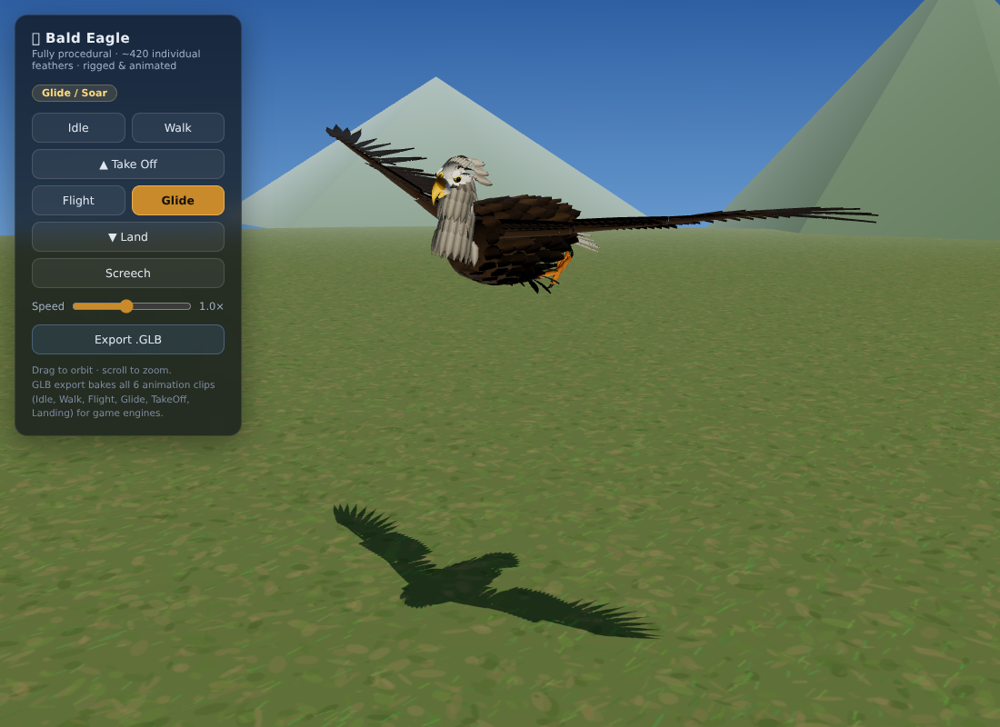

# 🦅 Procedural Animated Bald Eagle

A fully **procedural**, rigged and animated bald eagle built with Three.js —
no external model files, every polygon and feather is generated in code from
real anatomical references (FWS feather atlas wing topography, bald eagle
photo reference for head/beak/talon proportions).



## Anatomy (all procedural)
- **~470 individual feather meshes** with generated barb/alpha textures:
  - 10 emarginated **primaries** per wing (fingered tips, correct length profile)
  - 13 **secondaries** + tertials forming the trailing edge
  - greater / median / lesser / marginal & primary **covert rows**, **alula**
  - 12 white **rectrices** (tail) + upper/under tail coverts
  - shingled body contour rows, white lanceolate **neck hackles**, nape, crown, leg "pants"
- Lofted torso/skull, hooked **beak** with cere, nostrils and opening jaw,
  supraorbital **brow ridge**, amber eyes with pupils and blink
- Bare yellow tarsi with scale texture, 4 toes per foot with curved black **talons**
- Full bone hierarchy: spine/neck chain, jaw, shoulder→elbow→wrist per wing,
  hip→knee→ankle→foot→toes per leg, tail base

## Animations (procedural state machine)
| Clip | Notes |
|---|---|
| **Idle** | breathing, saccadic head scans, blinks, weight shifts, tail flicks, feather rouse |
| **Walk** | alternating gait with characteristic avian head-bob and waddle roll |
| **Take off** | crouch → leap → 3 deep power-strokes → climb-out, legs tuck |
| **Flight** | 2.5 Hz asymmetric wingbeat, upstroke wing-fold, downstroke twist & primary spread |
| **Glide** | full-span soar with dihedral, fingered primaries, turbulence flutter, banking wander |
| **Landing** | flare (nose-up, tail airbrake, legs reach) → touchdown absorb → wing fold |

Primary feathers fan/collapse continuously between folded and spread via
per-feather quaternion interpolation; the tail fans procedurally.

## Plumage variants
The **Plumage** selector retints the whole bird procedurally:
- **Bald Eagle** — white head/tail, dark brown body, yellow beak
- **Golden Eagle** — golden nape hackles, dark tail, grey beak, yellow cere
- **Gyrfalcon (dark morph)** — slate plumage, pale nape streaks, dark eyes

The GLB export bakes whichever plumage is currently selected.
A synthesized raptor screech (WebAudio) plays on **Screech** and at launch.

## Files
- `bald_eagle_animated.glb` — baked export (hierarchy + all 6 keyframed clips,
  30 fps) ready for Unity / Unreal / Godot / Blender.
- `src/eagle.js` — model builder · `src/animator.js` — animation system ·
  `src/feathers.js` — feather geometry/materials · `src/export.js` — GLB baker

## Run
```bash
npm install
npm run dev   # interactive viewer with state buttons + GLB export
```
